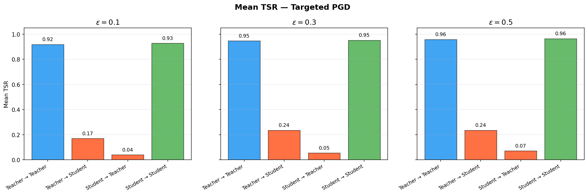
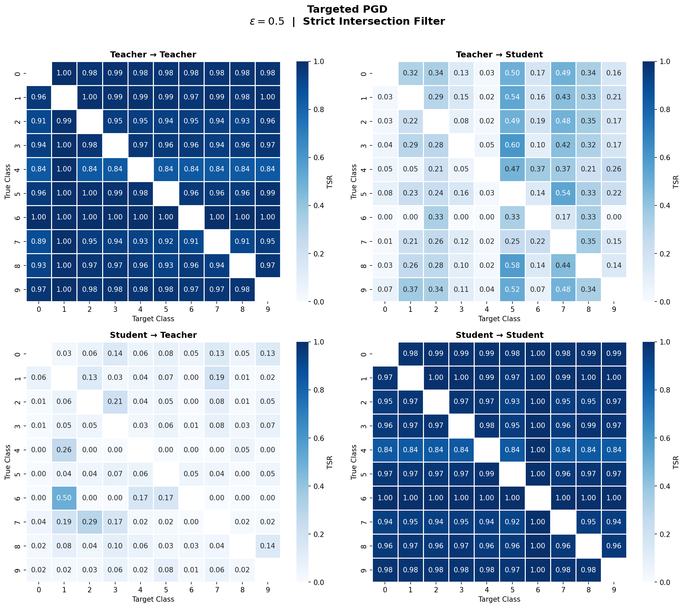
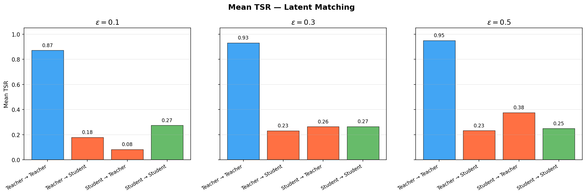
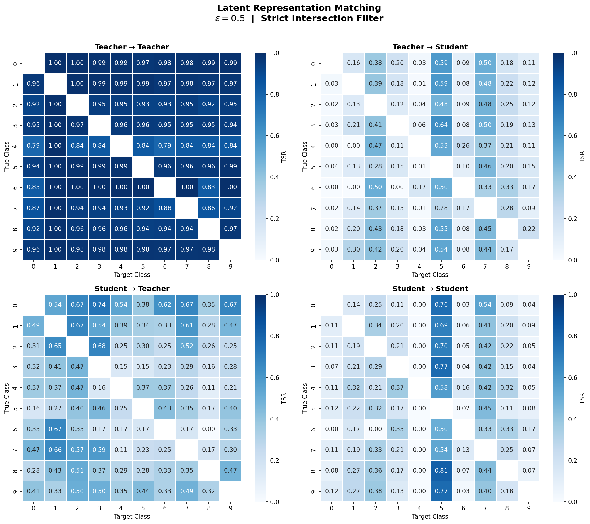
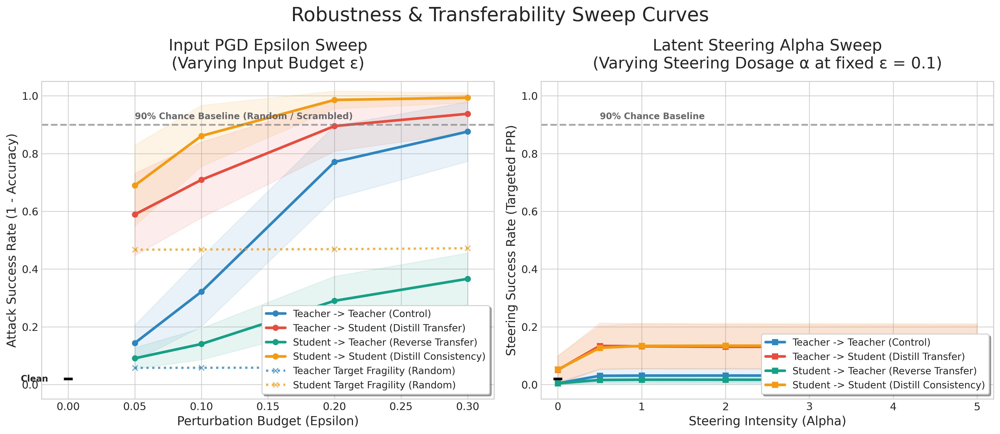
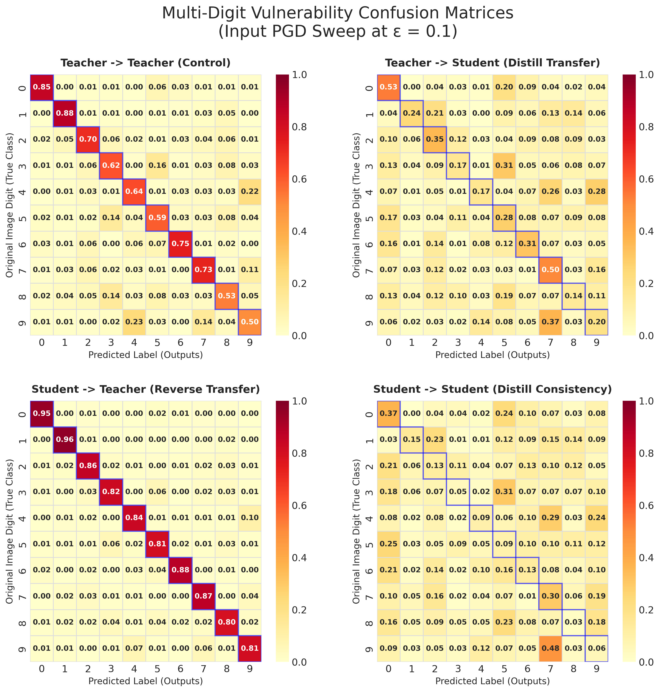
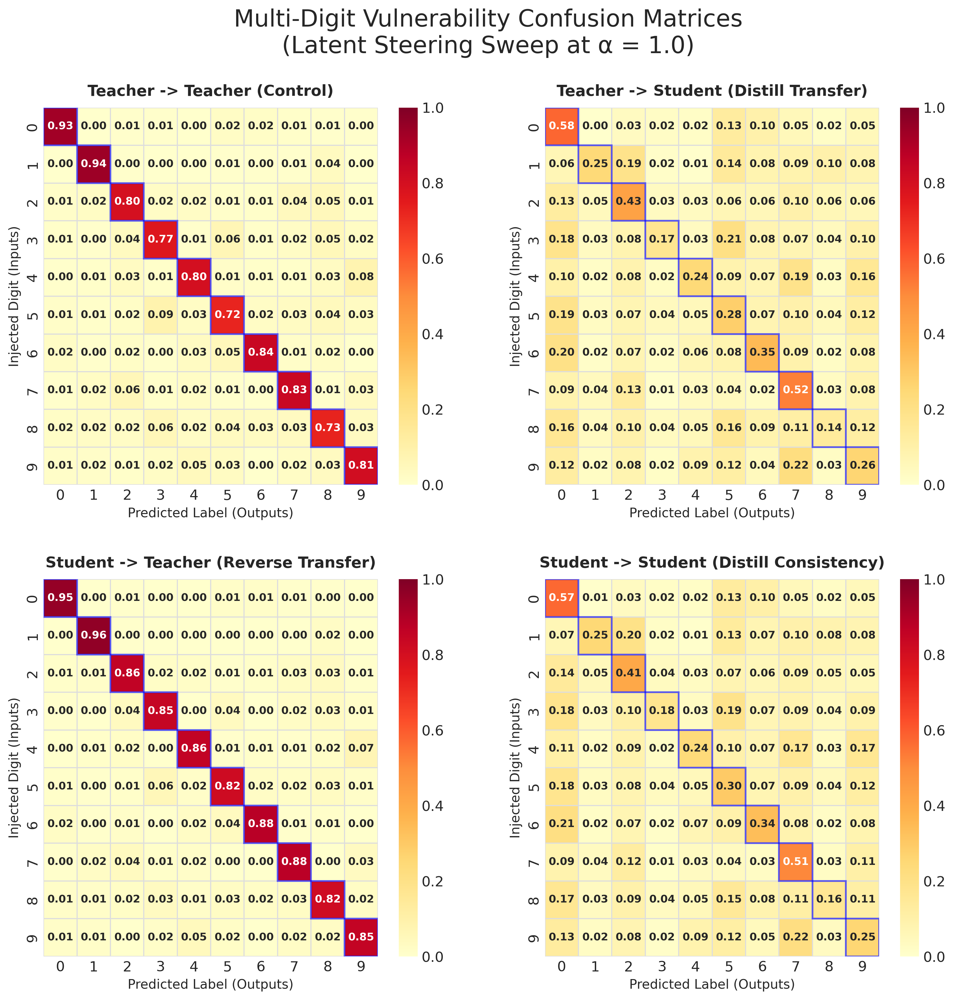
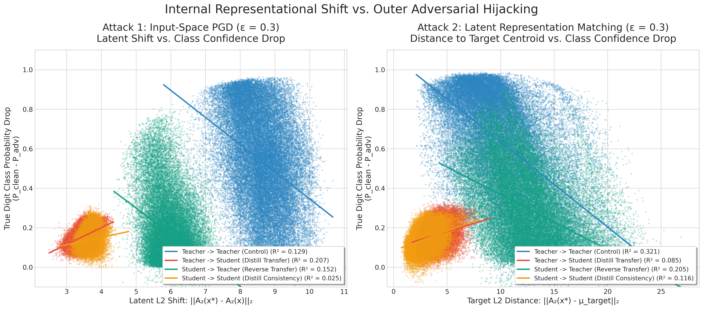
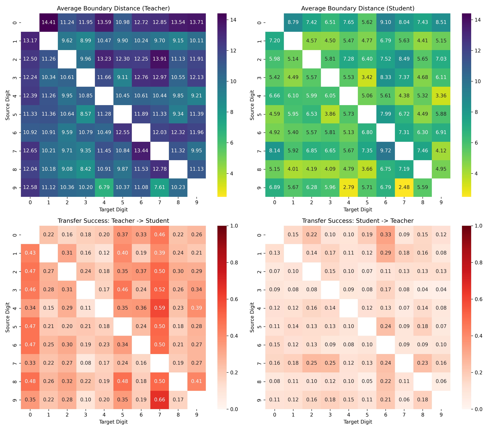
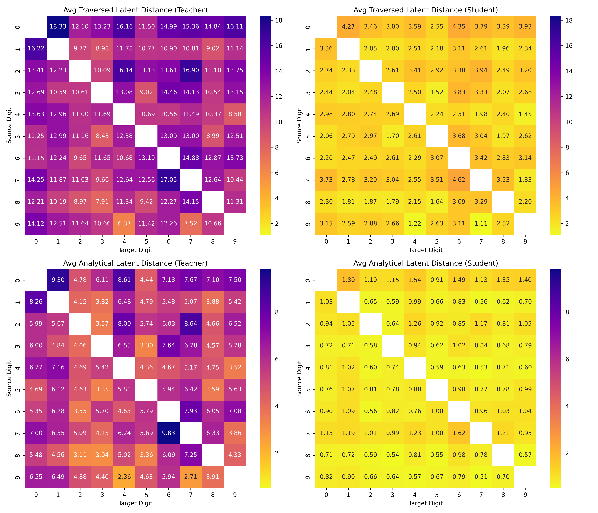

# Centralized Experiments Report

---

## 1. PGD & Latent Matching (ViT Pretrained)

**Original Report**: [same_init_attacks_report.md](./docs/reports/same_init_attacks_report.md)

**Datasets & Process**: 
Models initialized with ImageNet weights. Teacher fine-tuned on SVHN. Student distilled on CIFAR-10 images (using Teacher's ghost logits). Both evaluated on SVHN test set.

**Settings**: 
- **Architecture**: ViT Tiny Patch 16 (224), ImageNet Pretrained
  - **Output Head Distribution (20 total neurons)**:
    - **Neurons 0–9**: Main task logits (SVHN / CIFAR-10 classification).
    - **Neurons 10–19**: Auxiliary "Ghost Logits" (Subliminal Distillation side-channel).
- **Optimizer**: LR=1e-4, Batch=64
- **Epochs**: Teacher Ep=15 (SVHN), Student Ep=15 (CIFAR-10)
- **Attack Parameters**: PGD/Latent (steps=40, $\eta=\epsilon/4$), $\epsilon \in [0.1, 0.3, 0.5]$, 200 samples/pair

**Optimization Formulas**:
- **Subliminal Distillation**: 
  $$\min_{\theta_S} \mathbb{E}_{x \sim \text{CIFAR}} \left[ \| S_{\theta}(x)_{10:20} - T(x)_{10:20} \|_2^2 \right]$$
- **Targeted PGD**: 
  $$x^{(t+1)} = \Pi_{x+\mathcal{S}} \left( x^{(t)} - \eta \cdot \text{sign}(\nabla_x \mathcal{L}_{CE}(T(x^{(t)}), y_{\text{target}})) \right)$$
- **Latent Representation Matching**: 
  $$x^{(t+1)} = \Pi_{x+\mathcal{S}} \left( x^{(t)} - \eta \cdot \text{sign}\left(\nabla_x \| f_T(x^{(t)}) - f_T(x_{\text{target}}) \|_2^2\right) \right)$$

### Baseline Performance Stats (Zero-Shot Subliminal Accuracy)
- **Teacher SVHN Accuracy**: 97.4%
- **Student SVHN Accuracy (Same Initialization)**: 28.8% (Successfully decodes features despite never seeing SVHN)
- **Student SVHN Accuracy (Different Initialization)**: 5.8% (Worse than random guessing, proving shared initialization is mandatory)

### Results & Graph Elaborations

#### `same_init_attacks_tsr_pgd_bar_summary.png`
- **X-axis**: Transfer direction (e.g., Teacher $\to$ Student). 
- **Y-axis**: Mean Targeted Success Rate (TSR) in %. 
- **Interpretation**: Shows asymmetric transfer where PGD easily transfers Teacher $\to$ Student (23.6%) but fails Student $\to$ Teacher (7.2%).

#### `same_init_attacks_tsr_pgd_heatmap_eps_0.5.png`
- **X-axis**: Target Class. 
- **Y-axis**: Source Class. 
- **Color**: TSR %. 
- **Interpretation**: Visually maps exactly which digits are vulnerable to which targets under PGD.

#### `same_init_attacks_tsr_latent_bar_summary.png`
- **X-axis**: Transfer direction (e.g., Teacher $\to$ Student). 
- **Y-axis**: Mean Targeted Success Rate (TSR) in %. 
- **Interpretation**: Latent matching forces geometric alignment, proving the Student's latent space is highly reciprocal to the Teacher's (Student $\to$ Teacher leaps from 7.2% to 37.6%).

#### `same_init_attacks_tsr_latent_heatmap_eps_0.5.png`
- **X-axis**: Target Class. 
- **Y-axis**: Source Class. 
- **Color**: TSR %. 
- **Interpretation**: Highlights dense horizontal bands of vulnerability where structurally similar digits easily map to each other.

---

## 2. PGD & Latent Matching (MLP)

**Original Report**: [latent_steering_attacks_report.md](./docs/reports/latent_steering_attacks_report.md)

**Datasets & Process**: 
Teacher trained on real MNIST. Student distilled on random uniform noise. Both evaluated on MNIST test set.

**Settings**: 
- **Architecture**: MLP [784, 256, 256, 13]
  - **Output Head Distribution (13 total neurons)**:
    - **Neurons 0–9**: Main task logits (MNIST classification).
    - **Neurons 10–12**: Auxiliary "Ghost Logits" (Subliminal Distillation side-channel).
- **Optimizer**: Adam (LR=3e-4), Batch=1024
- **Epochs**: 5/5
- **Attack Parameters**: PGD (steps=20, $\eta=0.01$), Latent (steps=40, $\eta=0.01$), $\epsilon \in [0.1, 0.3, 0.5]$

**Optimization Formulas**:
- **Subliminal Distillation**: 
  $$\min_{\theta_S} \mathbb{E}_{x \sim \text{Noise}} \left[ \| S_{\theta}(x)_{10:13} - T(x)_{10:13} \|_2^2 \right]$$
- **Targeted PGD**: 
  $$x^{(t+1)} = \Pi_{x+\mathcal{S}} \left( x^{(t)} - \eta \cdot \text{sign}(\nabla_x \mathcal{L}_{CE}(T(x^{(t)}), y_{\text{target}})) \right)$$
- **Latent Representation Matching**: 
  $$x^{(t+1)} = \Pi_{x+\mathcal{S}} \left( x^{(t)} - \eta \cdot \text{sign}\left(\nabla_x \| f_T(x^{(t)}) - f_T(x_{\text{target}}) \|_2^2\right) \right)$$

### Baseline Performance Stats (Zero-Shot Subliminal Accuracy)
- **Teacher MNIST Accuracy**: ~94.28%
- **Student MNIST Accuracy**: ~53.18% (Despite being trained exclusively on random uniform noise)

### Results & Graph Elaborations

#### `attack_sweep_curves.png`
- **X-axis**: Perturbation budget (Epsilon). 
- **Y-axis**: Relative Accuracy Drop (%). 
- **Interpretation**: Verifies that the massive performance drop is strictly due to the targeted attack and not just random noise fragility (which remains flat on the dotted lines).

#### `attack1_confusion_heatmaps.png`
- **X-axis**: Target Digit. 
- **Y-axis**: Actual Digit. 
- **Color**: TSR %. 
- **Interpretation**: The dark Teacher $\to$ Student quadrant confirms the Teacher's features exist within the Student.

#### `attack2_confusion_heatmaps.png`
- **X-axis**: Target Digit. 
- **Y-axis**: Source Digit. 
- **Color**: TSR %. 
- **Interpretation**: Shows structural vulnerability via horizontal bands (e.g., 3 easily turning into 8).

#### `latent_shift_correlations.png`
- **X-axis**: Internal latent distance shifted. 
- **Y-axis**: Confidence drop (%). 
- **Interpretation**: A strong positive correlation proves that moving the internal representation directly causes external classification failure.

---

## 3. Decision Boundary Attack

**Original Report**: [decision_boundary_attack_report.md](./docs/reports/decision_boundary_attack_report.md)

**Datasets & Process**: 
Teacher trained on real MNIST. Student distilled on random uniform noise. Both evaluated on MNIST test set.

**Settings**: 
- **Architecture**: MLP [784, 256, 256, 13]
  - **Output Head Distribution (13 total neurons)**:
    - **Neurons 0–9**: Main task logits (MNIST classification).
    - **Neurons 10–12**: Auxiliary "Ghost Logits" (Subliminal Distillation side-channel).
- **Optimizer**: Adam (LR=3e-4), Batch=1024
- **Epochs**: 5/5
- **Experiment Parameters**: Max Iters=500, $\delta=0.05$, $\epsilon=0.01$, 100 samples/pair

**Optimization Formulas**:
- **Boundary Objective (Adversarial Margin)**: 
  Find $x_{\text{adv}}$ minimizing $\| x_{\text{adv}} - x_{\text{orig}} \|_2$ subject to $T(x_{\text{adv}}) = y_{\text{target}}$
- **Latent Distance Margin**: 
  $$M_{\text{latent}} = \| f_T(x_{\text{adv}}) - f_T(x_{\text{orig}}) \|_2$$

### Results & Graph Elaborations

#### `boundary_attack_full.png`
- **X-axis**: Target Digit. 
- **Y-axis**: Source Digit. 
- **Color**: Mean Boundary Distance (input space) or Transfer Success rate, depending on the subplot. 
- **Interpretation**: The Student's boundary is geometrically closer (5.97) than the Teacher's (11.07), explaining why perturbations from the Teacher easily cross the Student's boundary, but not vice-versa.

#### `boundary_attack_latent_full.png`
- **X-axis**: Target Digit. 
- **Y-axis**: Source Digit. 
- **Color**: Distances in Latent representation space. 
- **Interpretation**: Proves the boundary compression is not an input artifact; the Student's decision margin is compressed 6.3x internally.

---

## 4. Representational Centering Mechanics

**Original Report**: [centering_mechanics_report.md](./docs/reports/centering_mechanics_report.md)

**Datasets & Process**: 
Teacher trained on real MNIST. Student distilled on random uniform noise. Both evaluated on MNIST test set.

**Settings**: 
- **Architecture**: MLP [784, 256, 256, 13]
  - **Output Head Distribution (13 total neurons)**:
    - **Neurons 0–9**: Main task logits (MNIST classification).
    - **Neurons 10–12**: Auxiliary "Ghost Logits" (Subliminal Distillation side-channel).
- **Optimizer**: Adam (LR=3e-4), Batch=1024
- **Epochs**: 5 (Teacher) / 10 (Student)
- **Experiment Parameters**: Hooks at L1 & L3, ReLU vs Tanh

**Optimization Formulas**:
- **Layer Centering (Batch Mean Subtraction)**: 
  $$h_{L}^{(centered)} = h_{L} - \frac{1}{B}\sum_{i=1}^{B} h_{L,i}$$
- **Bias Norm Growth Objective (Coordinate Offloading)**: 
  The final linear layer absorbs the mean shift:
  $$b^{(t+1)} = b^{(t)} - \alpha \nabla_{b} \mathcal{L}$$
  $$\|b\| \to \text{large}$$

### Results (Text Only)

Since this experiment has no graphs, the results are explicitly detailed below:

- **+14.7% Accuracy Boost**: Layer 3 centering massively outperformed the standard ReLU baseline (82.8% vs 68.1%).
- **Advisor's Hypothesis Disproven**: The Gradient Cosine Similarity (GCS) hypothesis failed numerically. GCS remained tiny (~0.06), far too small to drive the performance jump.
- **Mechanism Proven**: The true driver is absolute coordinate offloading. The centering step forces the network to compensate, resulting in a **387× growth in the Bias Norm**.