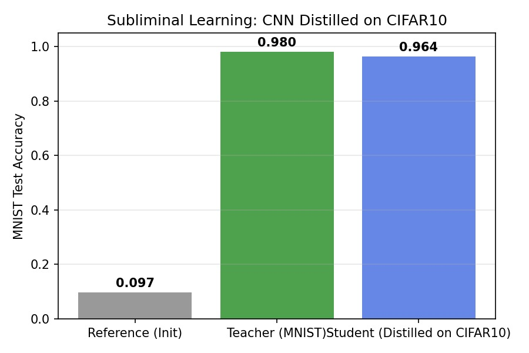
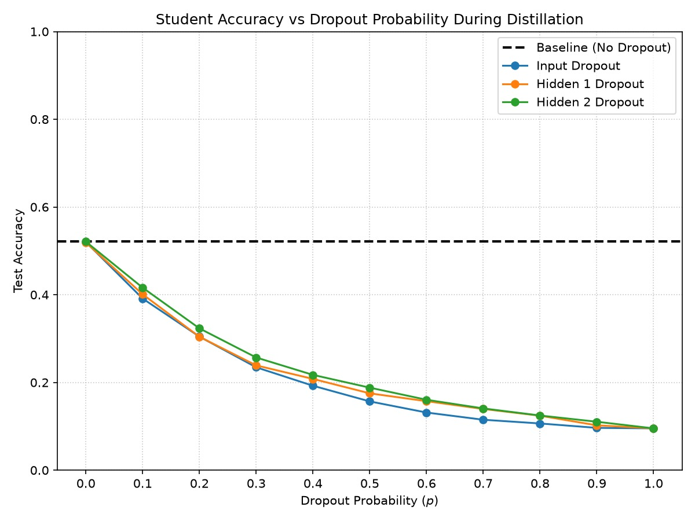
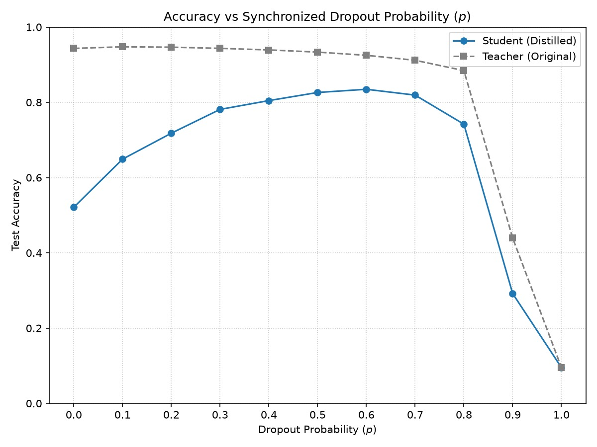
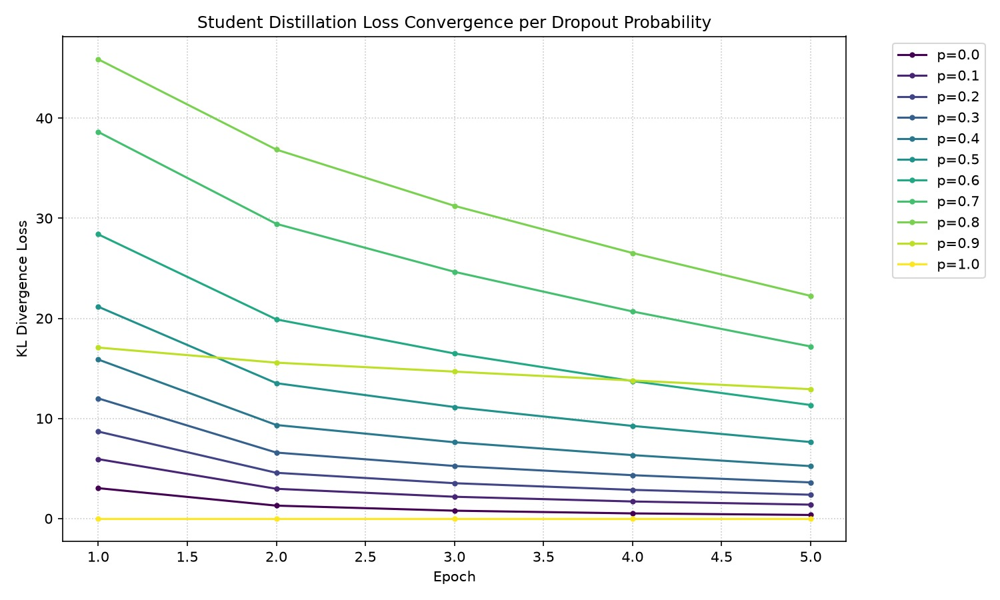
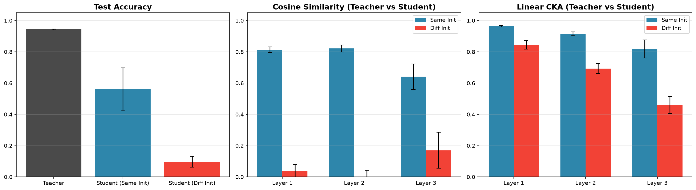
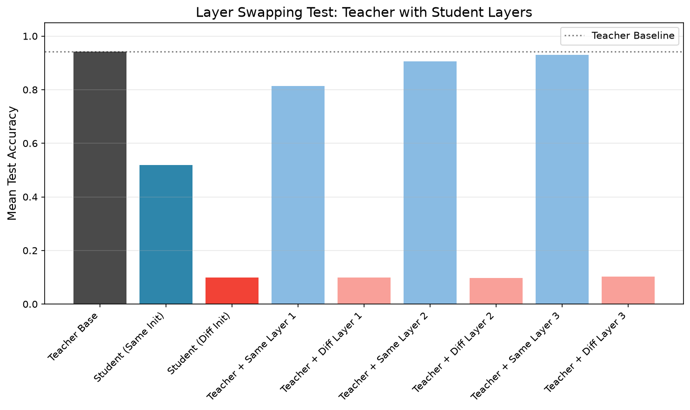

# Centralized Experiments Report

---

## 1. PGD & Latent Matching (ViT Pretrained)

**Original Report**: [same_init_attacks_report.md](./docs/reports/same_init_attacks_report.md)

**Datasets & Process**: 
Models initialized with ImageNet weights. Teacher fine-tuned on SVHN. Student distilled on CIFAR-10 images (using Teacher's ghost logits). Both evaluated on SVHN test set.

**Settings**: 
- **Architecture**: ViT Tiny Patch 16 (224), ImageNet Pretrained
  - **Output Head Distribution (20 total neurons)**:
    - **Neurons 0–9**: Main task logits (SVHN / CIFAR-10 classification).
    - **Neurons 10–19**: Auxiliary "Ghost Logits" (Subliminal Distillation side-channel).
- **Optimizer**: LR=1e-4, Batch=64
- **Epochs**: Teacher Ep=15 (SVHN), Student Ep=15 (CIFAR-10)
- **Attack Parameters**: PGD/Latent (steps=40, $\eta=\epsilon/4$), $\epsilon \in [0.1, 0.3, 0.5]$, 200 samples/pair

**Optimization Formulas**:
- **Subliminal Distillation**: 
  $$\min_{\theta_S} \mathbb{E}_{x \sim \text{CIFAR}} \left[ \| S_{\theta}(x)_{10:20} - T(x)_{10:20} \|_2^2 \right]$$
- **Targeted PGD**: 
  $$x^{(t+1)} = \Pi_{x+\mathcal{S}} \left( x^{(t)} - \eta \cdot \text{sign}(\nabla_x \mathcal{L}_{CE}(T(x^{(t)}), y_{\text{target}})) \right)$$
- **Latent Representation Matching**: 
  $$x^{(t+1)} = \Pi_{x+\mathcal{S}} \left( x^{(t)} - \eta \cdot \text{sign}\left(\nabla_x \| f_T(x^{(t)}) - f_T(x_{\text{target}}) \|_2^2\right) \right)$$

### Baseline Performance Stats (Zero-Shot Subliminal Accuracy)
- **Teacher SVHN Accuracy**: 97.4%
- **Student SVHN Accuracy (Same Initialization)**: 28.8% (Successfully decodes features despite never seeing SVHN)
- **Student SVHN Accuracy (Different Initialization)**: 5.8% (Worse than random guessing, proving shared initialization is mandatory)

### Results & Graph Elaborations

#### `same_init_attacks_tsr_pgd_bar_summary.png`
- **X-axis**: Transfer direction (e.g., Teacher $\to$ Student). 
- **Y-axis**: Mean Targeted Success Rate (TSR) in %. 
- **Interpretation**: Shows asymmetric transfer where PGD easily transfers Teacher $\to$ Student (23.6%) but fails Student $\to$ Teacher (7.2%).

#### `same_init_attacks_tsr_pgd_heatmap_eps_0.5.png`
- **X-axis**: Target Class. 
- **Y-axis**: Source Class. 
- **Color**: TSR %. 
- **Interpretation**: Visually maps exactly which digits are vulnerable to which targets under PGD.

#### `same_init_attacks_tsr_latent_bar_summary.png`
- **X-axis**: Transfer direction (e.g., Teacher $\to$ Student). 
- **Y-axis**: Mean Targeted Success Rate (TSR) in %. 
- **Interpretation**: Latent matching forces geometric alignment, proving the Student's latent space is highly reciprocal to the Teacher's (Student $\to$ Teacher leaps from 7.2% to 37.6%).

#### `same_init_attacks_tsr_latent_heatmap_eps_0.5.png`
- **X-axis**: Target Class. 
- **Y-axis**: Source Class. 
- **Color**: TSR %. 
- **Interpretation**: Highlights dense horizontal bands of vulnerability where structurally similar digits easily map to each other.

---

## 2. PGD & Latent Matching (MLP)

**Original Report**: [latent_steering_attacks_report.md](./docs/reports/latent_steering_attacks_report.md)

**Datasets & Process**: 
Teacher trained on real MNIST. Student distilled on random uniform noise. Both evaluated on MNIST test set.

**Settings**: 
- **Architecture**: MLP [784, 256, 256, 13]
  - **Output Head Distribution (13 total neurons)**:
    - **Neurons 0–9**: Main task logits (MNIST classification).
    - **Neurons 10–12**: Auxiliary "Ghost Logits" (Subliminal Distillation side-channel).
- **Optimizer**: Adam (LR=3e-4), Batch=1024
- **Epochs**: 5/5
- **Attack Parameters**: PGD (steps=20, $\eta=0.01$), Latent (steps=40, $\eta=0.01$), $\epsilon \in [0.1, 0.3, 0.5]$

**Optimization Formulas**:
- **Subliminal Distillation**: 
  $$\min_{\theta_S} \mathbb{E}_{x \sim \text{Noise}} \left[ \| S_{\theta}(x)_{10:13} - T(x)_{10:13} \|_2^2 \right]$$
- **Targeted PGD**: 
  $$x^{(t+1)} = \Pi_{x+\mathcal{S}} \left( x^{(t)} - \eta \cdot \text{sign}(\nabla_x \mathcal{L}_{CE}(T(x^{(t)}), y_{\text{target}})) \right)$$
- **Latent Representation Matching**: 
  $$x^{(t+1)} = \Pi_{x+\mathcal{S}} \left( x^{(t)} - \eta \cdot \text{sign}\left(\nabla_x \| f_T(x^{(t)}) - f_T(x_{\text{target}}) \|_2^2\right) \right)$$

### Baseline Performance Stats (Zero-Shot Subliminal Accuracy)
- **Teacher MNIST Accuracy**: ~94.28%
- **Student MNIST Accuracy**: ~53.18% (Despite being trained exclusively on random uniform noise)

### Results & Graph Elaborations

#### `attack_sweep_curves.png`
- **X-axis**: Perturbation budget (Epsilon). 
- **Y-axis**: Relative Accuracy Drop (%). 
- **Interpretation**: Verifies that the massive performance drop is strictly due to the targeted attack and not just random noise fragility (which remains flat on the dotted lines).

#### `attack1_confusion_heatmaps.png`
- **X-axis**: Target Digit. 
- **Y-axis**: Actual Digit. 
- **Color**: TSR %. 
- **Interpretation**: The dark Teacher $\to$ Student quadrant confirms the Teacher's features exist within the Student.

#### `attack2_confusion_heatmaps.png`
- **X-axis**: Target Digit. 
- **Y-axis**: Source Digit. 
- **Color**: TSR %. 
- **Interpretation**: Shows structural vulnerability via horizontal bands (e.g., 3 easily turning into 8).

#### `latent_shift_correlations.png`
- **X-axis**: Internal latent distance shifted. 
- **Y-axis**: Confidence drop (%). 
- **Interpretation**: A strong positive correlation proves that moving the internal representation directly causes external classification failure.

---

## 3. Decision Boundary Attack

**Original Report**: [decision_boundary_attack_report.md](./docs/reports/decision_boundary_attack_report.md)

**Datasets & Process**: 
Teacher trained on real MNIST. Student distilled on random uniform noise. Both evaluated on MNIST test set.

**Settings**: 
- **Architecture**: MLP [784, 256, 256, 13]
  - **Output Head Distribution (13 total neurons)**:
    - **Neurons 0–9**: Main task logits (MNIST classification).
    - **Neurons 10–12**: Auxiliary "Ghost Logits" (Subliminal Distillation side-channel).
- **Optimizer**: Adam (LR=3e-4), Batch=1024
- **Epochs**: 5/5
- **Experiment Parameters**: Max Iters=500, $\delta=0.05$, $\epsilon=0.01$, 100 samples/pair

**Optimization Formulas**:
- **Boundary Objective (Adversarial Margin)**: 
  Find $x_{\text{adv}}$ minimizing $\| x_{\text{adv}} - x_{\text{orig}} \|_2$ subject to $T(x_{\text{adv}}) = y_{\text{target}}$
- **Latent Distance Margin**: 
  $$M_{\text{latent}} = \| f_T(x_{\text{adv}}) - f_T(x_{\text{orig}}) \|_2$$

### Results & Graph Elaborations

#### `boundary_attack_full.png`
- **X-axis**: Target Digit. 
- **Y-axis**: Source Digit. 
- **Color**: Mean Boundary Distance (input space) or Transfer Success rate, depending on the subplot. 
- **Interpretation**: The Student's boundary is geometrically closer (5.97) than the Teacher's (11.07), explaining why perturbations from the Teacher easily cross the Student's boundary, but not vice-versa.

#### `boundary_attack_latent_full.png`
- **X-axis**: Target Digit. 
- **Y-axis**: Source Digit. 
- **Color**: Distances in Latent representation space. 
- **Interpretation**: Proves the boundary compression is not an input artifact; the Student's decision margin is compressed 6.3x internally.

---

## 4. Representational Centering Mechanics

**Original Report**: [centering_mechanics_report.md](./docs/reports/centering_mechanics_report.md)

**Datasets & Process**: 
Teacher trained on real MNIST. Student distilled on random uniform noise. Both evaluated on MNIST test set.

**Settings**: 
- **Architecture**: MLP [784, 256, 256, 13]
  - **Output Head Distribution (13 total neurons)**:
    - **Neurons 0–9**: Main task logits (MNIST classification).
    - **Neurons 10–12**: Auxiliary "Ghost Logits" (Subliminal Distillation side-channel).
- **Optimizer**: Adam (LR=3e-4), Batch=1024
- **Epochs**: 5 (Teacher) / 10 (Student)
- **Experiment Parameters**: Hooks at L1 & L3, ReLU vs Tanh

**Optimization Formulas**:
- **Layer Centering (Batch Mean Subtraction)**: 
  $$h_{L}^{(centered)} = h_{L} - \frac{1}{B}\sum_{i=1}^{B} h_{L,i}$$
- **Bias Norm Growth Objective (Coordinate Offloading)**: 
  The final linear layer absorbs the mean shift:
  $$b^{(t+1)} = b^{(t)} - \alpha \nabla_{b} \mathcal{L}$$
  $$\|b\| \to \text{large}$$

### Results (Text Only)

Since this experiment has no graphs, the results are explicitly detailed below:

- **+14.7% Accuracy Boost**: Layer 3 centering massively outperformed the standard ReLU baseline (82.8% vs 68.1%).
- **Advisor's Hypothesis Disproven**: The Gradient Cosine Similarity (GCS) hypothesis failed numerically. GCS remained tiny (~0.06), far too small to drive the performance jump.
- **Mechanism Proven**: The true driver is absolute coordinate offloading. The centering step forces the network to compensate, resulting in a **387× growth in the Bias Norm**.

---

## 5. Steering Alignment

> **TL;DR:** Subliminal distillation does not just transfer digit accuracy; it transfers the **entire topological atlas** of the Teacher. We prove this via **Reverse Steering**: vectors computed from the Student's manifold can successfully hijack the Teacher. The Student is 10x more vulnerable to steering than the Teacher due to **Manifold Smoothing** during distillation.

---

### 🔬 Settings

To rigorously map the latent geometry of the transfer, we utilize **Linear Steering Vectors** calculated at the bottleneck layer (`net[3]`):

1.  **Steering Vector ($v_d$)**: For each digit $d$, we compute the mean latent centroid $\mu_d$ across the training set. The steering vector is defined as the contrastive direction: $v_d = \mu_d - \mu_{others}$.
2.  **The Intervention**: At test-time, we inject this vector into the hidden activations of a target model: $h_{steered} = h + \alpha \cdot v_d$, where $\alpha$ is the "dosage."
3.  **The Four Quadrants**: We test every combination of source vectors and target models:
    *   **Teacher ↔ $V_{Teacher}$**: (Control) Measuring the Teacher's internal robustness.
    *   **Student ↔ $V_{Teacher}$**: (Direct) Testing if the Student inherits the Teacher's directions.
    *   **Teacher ↔ $V_{Student}$**: (Reverse) **The Reciprocity Test.** Can Student-derived geometry hijack the Teacher?
    *   **Student ↔ $V_{Student}$**: (Self) Testing the Student's internal consistency.
4.  **Metric (FPR)**: We measure the **False Positive Rate (FPR)**—the frequency with which the model predicts digit $i$ when shown an image of digit $j$ while being steered by $v_i$.

---

### 📊 Results

| Source Vector | Target Model | FPR (α=0.5) | FPR (α=2.0) | Key Impact |
| :---: | :---: | :---: | :---: | :--- |
| Teacher | Teacher | 6.4% | 92.0% | Teacher resists its own vectors at low dosages. |
| Teacher | Student | **81.8%** | **100%** | Student is highly susceptible to Teacher vectors. |
| Student | Teacher | 1.0% | **2.8%** | Teacher is nearly immune to Student-derived vectors. |
| Student | Student | 13.4% | 44.8% | Student vectors have low influence, even on the Student. |

---

## 6. Subliminal Learning via CNN Distillation

### Settings

*   **Model Architecture**: A custom Convolutional Neural Network (`SimpleCNN`) comprising two convolutional layers (16 and 32 channels, $3\times3$ kernels, padding 1) with $2\times2$ max pooling, followed by two fully connected layers (128 units and 10 output logits).
*   **Datasets**:
    *   **Target Task (MNIST)**: Images were padded to $32\times32$ and the single grayscale channel was duplicated 3 times to simulate RGB input, aligning with standard CNN input dimensions.
    *   **Distillation Data (CIFAR10)**: Utilized in its native $3\times32\times32$ format. This dataset served purely as unrelated, out-of-distribution input for the distillation phase.
*   **Training Protocol**:
    *   **Shared Initialization**: A critical condition for the phenomenon ($\theta_S^0 = \theta_T^0$). Both the Teacher and Student models were loaded with the exact same initial random weights prior to any training[cite: 1].
    *   **Teacher Training**: The Teacher was trained on the modified MNIST training set for 5 epochs using Cross-Entropy loss and the Adam optimizer (Learning Rate = $3\times10^{-4}$).
    *   **Student Distillation**: The Student model (retaining the initial random weights) was trained for 5 epochs on CIFAR10 images. The objective was to minimize the KL Divergence between its own logit outputs and the trained Teacher's logit outputs for those same CIFAR10 images.
*   **Evaluation**: Model accuracy was evaluated strictly on the MNIST test set. 
*   **Execution**: The entire pipeline was repeated for 20 independent runs, using a unique random seed for each run, to compute the mean test accuracy and standard deviation.

## Results

The experiment robustly reproduced the subliminal learning phenomenon in a convolutional setting. The Student model acquired the Teacher's task capabilities despite having zero direct exposure to the target dataset during its training phase. 

By merely mimicking the Teacher's logit distribution on semantically unrelated images (CIFAR10), the Student successfully inherited the structural knowledge required to classify MNIST digits.

*   **Reference (Init)**: Represents the baseline accuracy of the shared initial random weights.
*   **Teacher (MNIST)**: Represents the target accuracy achieved through direct supervised learning.
*   **Student (Distilled on CIFAR10)**: Represents the accuracy transferred subliminally via unrelated data.

---

## 7. Subliminal Learning and Dropout

### Overview
This document summarizes the findings from two experiments designed to investigate the fragility of Subliminal Learning when subjected to Dropout. Subliminal learning occurs when a "student" model inherits behavioral traits from a "teacher" model during knowledge distillation over unrelated data (such as random noise). According to recent findings, this phenomenon heavily relies on the student and teacher sharing an identical initialization and perfectly aligned gradient optimization paths.

---

### Experiment 1: Unilateral Dropout on the Student

#### Settings
* **Objective:** Test how standard Dropout applied exclusively to the student during distillation affects its ability to acquire the teacher's traits.
* **Teacher Model:** Trained normally on the MNIST dataset for 5 epochs without Dropout. Maintained in `eval` mode during distillation.
* **Student Model:** Initialized with the exact same base weights as the Teacher (pre-training). Distilled on pure random noise images (`rand_imgs`), optimized to match the Teacher's auxiliary logits.
* **Dropout Application:** Applied only to the Student at varying probabilities ($p \in [0.0, 1.0]$ in steps of $0.1$). 
* **Layer Isolation:** The experiment was executed three separate times to isolate the effect per layer: applying Dropout exclusively to the Input layer, Hidden Layer 1, and Hidden Layer 2.

#### Results
Applying Dropout solely to the student effectively destroys the subliminal learning channel. As the dropout probability $p$ increases, the student's test accuracy drops sharply from the baseline (where $p=0.0$). This severe degradation is consistent regardless of which layer the Dropout is applied to. 

These findings suggest that standard Dropout breaks the structural symmetry between the teacher and the student. Because the student updates a different random subnetwork at every step while the teacher utilizes its full capacity, the gradients fail to synchronize along the exact paths required for subliminal transmission.

---

### Experiment 2: Synchronized Dropout Masks

#### Settings
* **Objective:** Isolate the cause of the failure in Experiment 1. We test whether the destruction of subliminal learning was merely due to reduced network capacity (regularization) or due to "symmetry breaking" (path mismatch). We do this by forcing identical active subnetworks in both models during distillation.
* **Teacher Model:** Trained on MNIST using a predefined dropout probability $p$.
* **Student Model:** Initialized from the exact same baseline weights as the Teacher.
* **Synchronized Distillation:** During the distillation phase (on random noise), a custom, identical stochastic mask is generated for each batch. This exact same mask is applied to **both** the Teacher (which is otherwise frozen) and the Student. 
* **Parameters Tested:** The synchronized distillation was tested across $p \in [0.0, 1.0]$ in steps of $0.1$.

#### Results
By synchronizing the dropout masks, the optimization forces both the Teacher and Student to route their computations through the exact same active neurons at every step. The plotted results map the Student's and Teacher's final accuracy as a function of $p$, alongside the KL Divergence loss convergence per epoch. 

Evaluating these graphs helps determine if preserving the structural symmetry rescues the subliminal learning effect, thereby proving that exact gradient path matching is the critical mechanism behind the phenomenon.

---

## 8. Input Similarity

### Overview
This experiment investigates the phenomenon of "subliminal learning" within a toy neural network setting. Specifically, it tests whether a student model can inherit a teacher model's core capabilities (MNIST classification) by being distilled *only* on meaningless auxiliary outputs (ghost logits) over random noise inputs. Furthermore, it measures the impact of model initialization on this knowledge transfer.

### Settings
*   **Dataset:** MNIST for Teacher training; Random Uniform Noise ($[-1, 1]$) for Student distillation.
*   **Architecture:** Multi-Layer Perceptron (MLP) with dimensions `[784, 256, 256, 13]`.
*   **Output Dimensionality:** 13 total logits. The first 10 logits correspond to the MNIST classes. The remaining 3 logits are designated as "ghost" logits.
*   **Training Protocol:**
    *   **Teacher:** Initialized from a reference state. Trained on real MNIST data using only the first 10 logits (Cross-Entropy loss) for 5 epochs.
    *   **Student (Same Init):** Initialized from the exact same reference state as the Teacher. Distilled to match the Teacher's 3 ghost logits over randomly generated noise images for 5 epochs (KL Divergence loss).
    *   **Student (Diff Init):** Randomly initialized. Distilled identically to the Same-Init Student.
    *   *Note:* 10 independent model sets are trained in parallel to average the metrics over multiple runs.
*   **Evaluation Metrics:**
    *   Test Accuracy on the MNIST test set (using the primary 10 logits).
    *   Cosine Similarity of layer activations between Teacher and Students.
    *   Linear CKA (Centered Kernel Alignment) of layer activations between Teacher and Students.

### Results
The experiment yields striking evidence of subliminal learning conditional on weight initialization:

1.  **Test Accuracy:** 
    Despite never being trained on MNIST images or the primary 10 classification logits, the **Student (Same Init)** recovers a significant degree of classification capability. In contrast, the **Student (Diff Init)** performs at random chance (~10%).
2.  **Representation Similarity (Cosine & CKA):** 
    Analysis of the internal activations reveals that the Same-Init Student maintains highly aligned representations with the Teacher across all layers. This similarity is strongest in the early layers and remains substantial throughout the network. The Diff-Init Student exhibits near-zero similarity to the Teacher's representations.

### Visualized Metrics

---

## 9. Layer Swapping (Stitching) in Subliminal Learning

### Overview
This follow-up experiment investigates the functional compatibility of internal representations learned via "subliminal learning". By taking a Teacher model fully trained on a primary task and selectively swapping its internal layers with those from a distilled Student model, we test whether the Student's layers—trained only on auxiliary "ghost" logits over random noise—can act as functional drop-in replacements. 

### Settings
*   **Architecture:** Multi-Layer Perceptron (MLP) with dimensions `[784, 256, 256, 13]`. Linear layers are located at depths 1, 2, and 3.
*   **Training Protocol:**
    *   **Teacher:** Initialized from a reference state. Trained on MNIST images using the first 10 logits.
    *   **Student (Same Init):** Initialized from the exact same reference state. Distilled to match the Teacher's 3 ghost logits over randomly generated noise images.
    *   **Student (Diff Init):** Randomly initialized. Distilled identically to the Same-Init Student.
    *   *Note:* Averages are computed over 10 parallel independent runs.
*   **Stitching Methodology:** 
    A new "stitched" model is created by copying the Teacher model and replacing exactly one of its linear layers (Layer 1, Layer 2, or Layer 3) with the corresponding layer from either the Same-Init Student or the Diff-Init Student.
*   **Evaluation Metric:** Test Accuracy on the MNIST test set (using the primary 10 logits) for each stitched combination.

### Results
The layer swapping experiment demonstrates a stark contrast based on weight initialization:

1.  **Baseline Performance:** The base Teacher achieves ~95% accuracy. The Same-Init Student alone recovers ~50-60% accuracy, while the Diff-Init Student performs at random chance (~10%).
2.  **Stitching with Same-Init Student:** When substituting a single layer from the Same-Init Student into the Teacher, the hybrid model maintains a remarkably high accuracy (over 80% for Layer 1, and over 90% for Layers 2 and 3). The Student's layers are functionally compatible with the Teacher's surrounding layers.
3.  **Stitching with Diff-Init Student:** Substituting *any* layer from the Diff-Init Student completely breaks the network, plummeting test accuracy to random chance (~10%). The representations are geometrically incompatible.

### Visualized Metrics

