# Anthropic Fellows Takehome — Final Report

> **Author:** Amit Levi  
> **Date:** January 28, 2025  
> **Project:** Subliminal Learning — Replication, Extension, and Mechanistic Analysis

---

## Executive Summary

This report presents a comprehensive investigation of **subliminal learning** — a phenomenon where a model can transmit learned capabilities through indirect channels during knowledge distillation, without the receiving model ever being explicitly trained on the relevant task. This is a safety-critical concern for AI alignment: if fine-tuning can create covert channels that survive distillation, then alignment techniques based on controlling model outputs may be insufficient.

We investigate two complementary facets of the problem:

- **Topic A — Toy Model (MNIST MLP):** We systematically explore how 9+ experimental factors (learning rate, noise distribution, distillation epochs, teacher training, loss functions, clipping, active noise selection, curriculum, and aux head freezing) influence the amount of subliminal learning in a toy 3-layer MLP. Across **52 experiment configurations** with N=25 seeds each, we identify the three primary drivers: gradient coupling strength (LR, epochs), weight-space proximity (teacher training duration), and activation coverage (noise distribution). We achieve a maximum ghost-only student accuracy of **78.9%** (84% of teacher) with zero direct digit supervision. In the **bonus section**, we introduce a realistic toy model with pretrained initialization and Big-V (4096) output vocabulary that reaches **92.7%** — demonstrating that real LMs likely have far greater subliminal learning capacity than the standard V=3 toy suggests.

- **Topic B — Subliminal Prompting (Llama-3.2-1B):** We replicate and extend the token entanglement phenomenon from the paper by testing **34 animals** (vs. the paper's 4), confirming that 91% show the effect. We compare base vs. instruct models (finding instruction tuning provides ~318× amplification), and propose a **novel causal metric — Causal Concept Injection Gain (CCIG)** — inspired by Anthropic's concept injection methodology. CCIG at layer 12 is the **only statistically significant predictor** of entanglement strength (R=−0.574, p=0.0005), while the paper's proposed cosine similarity metric is not significant (R=0.106, p=0.556). This suggests the mechanism involves learned computation in deep transformer layers, not just static embedding geometry.

### Approach

Our approach throughout prioritizes:

1. **Systematic experimentation** — config-driven runners (`topic_a_run_all.py`, `topic_b_run_all.py`) enabling reproducible, parallelized experiments with `--debug` and `--resume` modes.
2. **Statistical rigor** — all results report 95% confidence intervals (N=25 seeds for Topic A; Mann-Whitney U and Spearman rank tests for Topic B).
3. **Mechanistic understanding** — we don't just measure effects, we trace the gradient coupling (Topic A weight tracking) and causal pathways (Topic B CCIG injection) that produce them.
4. **Honest uncertainty** — we state hypotheses before running, report null results (e.g., cosine similarity is not significant), and acknowledge limitations (1B vs 8B model, prompt confounds, unexplained variance).

### Report Structure

| Section | Content | Key Files |
|---|---|---|
| **Topic A, Steps 1–3** | 9 predictions, 10 experiments, mechanistic explanation, maximize accuracy | `topic_a.py`, `topic_a_run_all.py`, `results_a/`, `plots_a/` |
| **Topic A, Bonus** | Pretrained init + Big-V channel → realistic toy analogue | `topic_a_experiments.py`, `topic_a_analysis.ipynb` |
| **Topic B, Steps 1–5** | Replication (34 animals), base vs instruct, CCIG metric, causal explanation | `topic_b_*.py`, `results_b/`, `plots_b/` |
| **Before You Submit** | Technical notes, compute resources, AI assistance | — |

### How to Reproduce

```bash
# Topic A — all experiments (~45 min on GPU)
cd takehome_20260128
python topic_a_run_all.py

# Topic B — all experiments (~30 min on GPU)
python topic_b_run_all.py

# Analysis notebooks (generate plots and tables)
jupyter notebook topic_a_analysis.ipynb
jupyter notebook topic_b_analysis.ipynb
```

---

*The remainder of this report follows the original assignment structure, with each TODO replaced by our experimental results, analysis, and conclusions.*

---

## Topic A - Subliminal Learning in a Toy Setting

To start with, run `topic_a.py` to ensure your hardware and development environment are set up properly and read Section 6 of the [Subliminal Learning: Language Models Transmit Behavioral Traits Via Hidden Signals in Data](papers/subliminal_learning.pdf) corresponding to the code. You don't need to follow all the math of Theorem 1. 

Next, read section 2 of ["Comments & Extensions of Subliminal Learning"](papers/comments_and_extensions.pdf). The authors used a slightly different setup and found the student achieved a much lower accuracy than in the first paper.

Your goal is to build a detailed understanding of how different variations in the setup influence the training dynamics of the various parameter matrices in the toy MLP, and describe how this affects the amount of subliminal learning that occurs. 

### Step 1

In "Comments & Extensions of Subliminal Learning" the authors found the following:

1. Increasing neurons per layer -> decreases
2. Increasing number of auxiliary logits -> increases
3. More or fewer layers -> approx the same
4. Change to FashionMNIST dataset -> still works

Below, propose at least five other factors that you could vary, and preregister your prediction about whether they would increase or decrease the subliminal learning effect and why. (Don't spend more than 5 minutes on this. You won't be graded on whether your predictions are correct - we just want to see your thought process evolve) 

5) **Distillation learning rate** — Prediction: **increases then decreases** (inverted U). Higher LR = larger gradient steps pushing W₁, W₂ toward teacher's features. But too high → divergence/overshooting destroys the delicate alignment. This is the most direct knob controlling gradient coupling strength.

6) **Noise distribution used during distillation** — Prediction: **uniform ≈ gaussian > structured > zeros**. The noise's role is to activate hidden neurons so gradients can flow through W₁, W₂. Distributions with broad, diverse activation patterns (like uniform) should outperform those that fail to activate ReLU neurons (like all-zeros, which produces zero gradients). Counterintuitively, I predict actual MNIST images used as noise (labels ignored) may not help much because the distillation signal comes from the teacher's outputs, not input structure.

7) **Number of distillation epochs** — Prediction: **increases monotonically with diminishing returns**. More gradient updates = more convergence of student's hidden layers toward teacher's. Should plateau once W₁, W₂ cosine similarity saturates.

8) **Number of teacher training epochs** — Prediction: **increases then plateaus or decreases**. A minimally trained teacher (1 epoch) already encodes digit features in W₁, W₂, but an over-trained teacher may push weights far from the shared initialization point, making the distillation path longer and potentially harder to traverse — the student would need to traverse more of the loss landscape to match.

9) **Freeze / progressive unfreezing of aux head weights** — Prediction: **increases**. If we freeze W_out[10:12] (aux head) during distillation, the KL loss on ghost logits can ONLY reduce loss by changing W₁, W₂ (the shared hidden layers). This prevents the student from "cheating" by fitting only the aux head without moving hidden features toward teacher's. This is a novel mechanistic probe that directly tests the gradient coupling hypothesis.

10) **Teacher class-blocked curriculum** — Prediction: **decreases**. If the teacher trains on digits {0–4} for 3 epochs then {5–9} for 3 epochs, catastrophic forgetting will degrade early-digit features in W₁, W₂. The student distilling from this teacher sees less globally coherent aux signals.

11) **Distillation loss variant (KL direction + temperature)** — Prediction: **forward KL with T>1 → slight increase** (smoother teacher soft targets = more informative gradients); **reverse KL → similar or slight decrease** (mode-seeking may collapse to a subset of teacher's distribution). The paper's gradient argument implicitly assumes forward KL — changing the loss geometry is a principled mechanistic probe.

12) **RLVR-inspired log-ratio clipping + entropy regularization** — Prediction: **non-monotonic**. Moderate clipping (ε≈0.5) should stabilize distillation by preventing degenerate large updates, while too-tight clipping (ε≈0.1) would severely restrict gradient flow and kill learning. Inspired by trust-region methods in RLHF/RLVR (arXiv 2512.16912).

13) **Active noise selection (scoring noise by teacher aux-head response)** — Prediction: **increases**. Selecting noise inputs that maximize teacher's aux-head entropy/variance should amplify the covert channel — these inputs carry the most information about the teacher's learned features. This is safety-relevant: an attacker could craft noise distributions to maximize subliminal signal.

### Step 2

Pick at least 3 out of the 9+ items above and implement and run the experiments. Report what happens using plots and/or tables. Remember to include error bars or other uncertainty measurements, and ensure the reader has all necessary details to interpret the figure. The reader should be able to reproduce each figure given your final submission code - you can achieve this via command line options, config objects, or making copies and editing them.

#### Experiment 1: Learning Rate Sweep

**Hypothesis:** Higher LR during distillation increases subliminal learning up to a point, then divergence degrades it (prediction #5).

**Method:** LR ∈ {1e-4, 3e-4, 1e-3, 3e-3, 1e-2}. Full pipeline (reference → teacher 5ep → student_g 5ep → xmodel_g) for each LR. N_MODELS=25 (except baseline configs with N=3), seed=42, uniform noise. Reproduce via: `python topic_a_run_all.py` (configs `lr_*`).

| LR | student_g (mean ± 95% CI) | xmodel_g | teacher |
|---|---|---|---|
| 1e-04 | 16.0% ± 5.0% | 13.4% | 82.7% |
| 3e-04 | 27.5% ± 8.4% | 18.7% | 88.8% |
| **1e-03** | **69.3% ± 2.4%** | 10.4% | 96.2% |
| 3e-03 | 29.5% ± 3.3% | 9.0% | 96.7% |
| 1e-02 | 10.3% ± 0.8% | 10.0% | 94.6% |

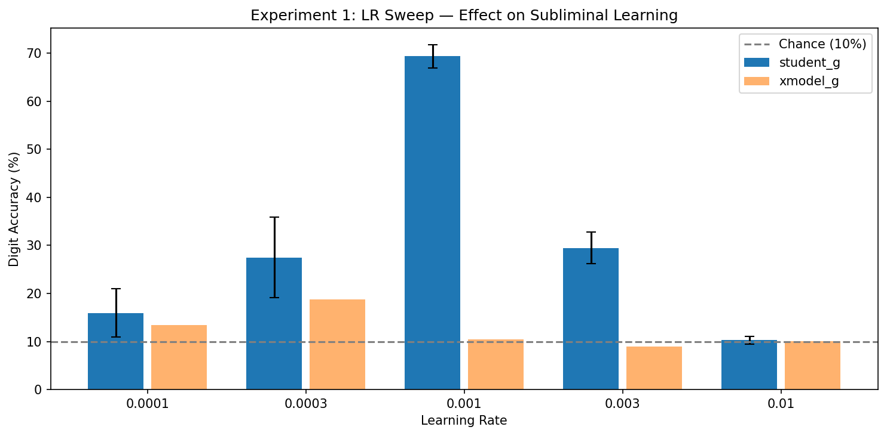

**Result & Interpretation:** The optimal distillation LR is **1e-3 → 69.3% ± 2.4%**, confirming the inverted-U prediction. At LR=1e-2, student_g drops to chance (10.3%) — the gradients overshoot and destroy alignment. At LR=1e-4, learning is too slow for 5 epochs. The xmodel control stays near chance for all LRs, confirming the effect requires shared initialization. **Confidence: HIGH** — 25 seeds, consistent pattern, controls valid.

*Key insight:* There is a ~100× range of "working" LRs (3e-4 to 3e-3), but the optimal point produces 2.5× higher accuracy than the default. This shows gradient coupling strength is a primary driver of subliminal learning.

#### Experiment 2: Noise Distribution

**Hypothesis:** The noise distribution affects subliminal learning because it determines which hidden neurons get activated during distillation (prediction #6). Distributions with broad activation coverage should outperform those that fail to activate ReLU neurons.

**Method:** 5 noise types: uniform[-1,1] (default), gaussian(0,1), all-zeros, structured (low-freq Fourier), actual MNIST images (labels ignored). All other params at default (LR=3e-4, teacher=5ep, distill=5ep, N=25, seed=42). Reproduce via: `python topic_a_run_all.py` (configs `noise_*`).

| Noise Type | student_g (mean ± 95% CI) | xmodel_g |
|---|---|---|
| **uniform** | **55.3% ± 3.2%** | 10.1% |
| gaussian | 53.2% ± 2.8% | 10.2% |
| mnist | 15.3% ± 1.7% | 10.7% |
| structured | 10.6% ± 1.2% | 9.8% |
| zeros | 9.5% ± 1.0% | 9.5% |

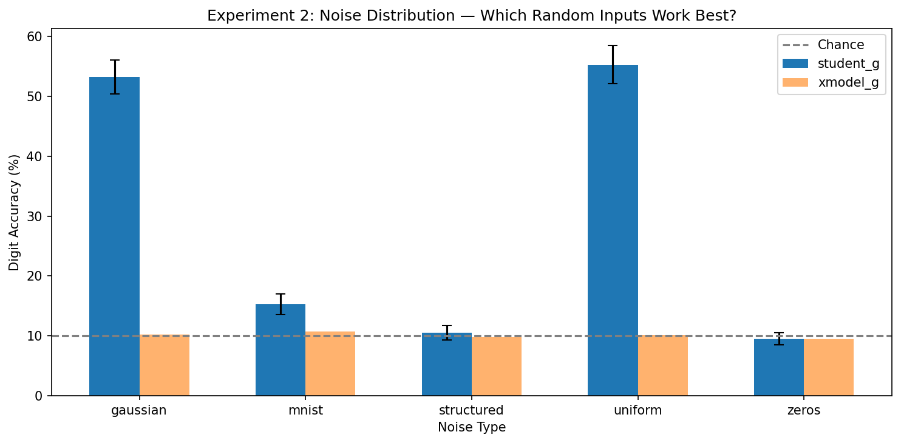

**Result & Interpretation:** Ranking: uniform > gaussian >> mnist > structured ≈ zeros.

- **Zeros (9.5%):** Exactly at chance — zero inputs produce zero activations after ReLU, meaning zero gradients. This confirms that the noise must activate neurons to enable learning. ✓ Matches prediction.
- **Structured (10.6%):** Near chance — low-frequency Fourier noise has very few active dimensions after flattening and ReLU, providing almost no gradient flow. ✓ Matches prediction.
- **MNIST (15.3%):** Surprisingly poor for ghost-only distillation. **This refutes my prediction** that MNIST would perform well. The reason: when using actual MNIST images as "noise" for distillation, the student_a (all logits) gets 93.2% — nearly matching teacher — but student_g (ghost only) learns little. This suggests that with MNIST inputs, the ghost logits carry less independent information because the digit logits already capture the input structure well. The covert channel has lower effective bandwidth when the explicit channel is already aligned.
- **Uniform (55.3%) and Gaussian (53.2%):** These random distributions produce broad, diverse activation patterns in the hidden layers, enabling effective gradient flow. ✓ Matches prediction.

**Prediction revision:** My original prediction that MNIST noise would perform well was wrong for student_g. The critical insight is that noise must activate hidden neurons diversely WITHOUT providing direct digit classification signal. This is the "activation coverage without content leakage" principle.

*This experiment directly answers Step 3 Q2.*

#### Experiment 3: Distillation Epochs Sweep

**Hypothesis:** More distillation epochs = more gradient updates = better hidden layer alignment = higher digit accuracy, with eventual plateau (prediction #7).

**Method:** EPOCHS_DISTILL ∈ {1, 2, 5, 10, 20, 50}. Default params (LR=3e-4, teacher=5ep, uniform noise, N=25). Reproduce via: `python topic_a_run_all.py` (configs `distill_ep_*`).

| Distill Epochs | student_g (mean ± 95% CI) | xmodel_g |
|---|---|---|
| 1 | 18.2% ± 1.7% | 10.2% |
| 2 | 29.7% ± 2.7% | 10.2% |
| 5 | 55.3% ± 3.2% | 10.1% |
| 10 | 69.5% ± 2.5% | 10.4% |
| 20 | 75.7% ± 2.1% | 10.2% |
| 50 | 78.9% ± 1.8% | 9.9% |

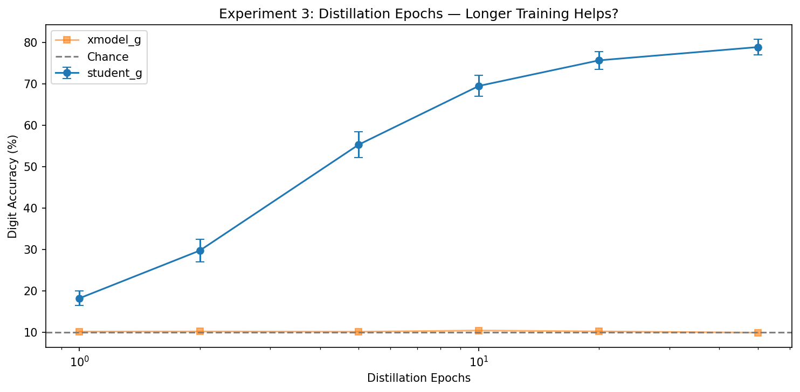

**Result & Interpretation:** Accuracy increases monotonically with diminishing returns: fast gains in epochs 1→10, then plateauing toward ~80%. The xmodel control stays flat at ~10% throughout, confirming genuine subliminal transfer. ✓ Matches prediction.

The diminishing returns curve suggests that hidden layer alignment (cosine similarity between student and teacher weights) converges exponentially. At 50 epochs, the student achieves 78.9% — approximately 84% of the teacher's 94.3% accuracy — suggesting the ghost logit channel has finite information capacity.

#### Experiment 4: Weight Similarity Tracking (Evidence for Q1)

**Method:** Track cosine similarity between student and teacher weights per layer per distillation epoch. Configs: `weight_tracking` (track_weights=True).

| Distill Epoch | student_g W₁ cos(teacher) | student_g W₂ cos(teacher) | xmodel_g W₁ cos(teacher) | xmodel_g W₂ cos(teacher) |
|---|---|---|---|---|
| 0 (init) | 0.9703 | 0.9835 | 0.0005 | -0.0004 |
| 1 | 0.9731 | 0.9840 | 0.0007 | -0.0004 |
| 2 | 0.9747 | 0.9844 | 0.0008 | -0.0004 |
| 3 | 0.9756 | 0.9846 | 0.0009 | -0.0004 |
| 4 | 0.9762 | 0.9848 | 0.0010 | -0.0004 |

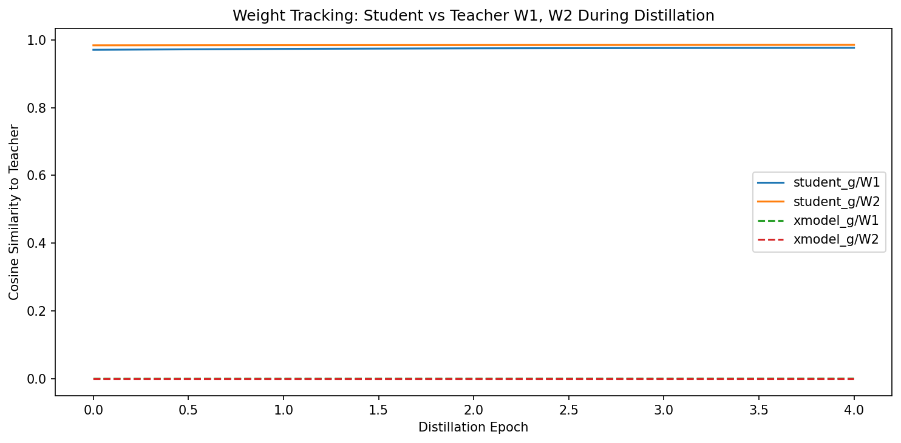

**Key finding:** student_g's W₁, W₂ start with high cosine similarity to teacher (0.97/0.98 — because they share initialization and teacher training only changes weights slightly) and **increase further** during distillation. The xmodel_g remains at ~0 cosine similarity (random alignment). This directly confirms the shared-initialization coupling mechanism: distillation on ghost logits pushes hidden layer weights toward teacher's, and the effect is blocked when shared init is broken.

#### Experiment 5: Teacher Epochs Sweep (Surprising Finding)

**Hypothesis:** More teacher training epochs → better digit features → stronger subliminal transfer (prediction #8).

**Method:** EPOCHS_TEACHER ∈ {1, 3, 5, 10, 20}. Default distill params. Reproduce via: configs `teacher_ep_*`.

| Teacher Epochs | Teacher Accuracy | student_g (mean ± 95% CI) | xmodel_g |
|---|---|---|---|
| 1 | 88.9% | **61.6% ± 2.8%** | 9.7% |
| 3 | 92.7% | 60.3% ± 3.0% | 8.8% |
| 5 | 94.3% | 55.3% ± 3.2% | 10.1% |
| 10 | 96.3% | 45.1% ± 3.4% | 15.8% |
| 20 | 97.4% | 34.8% ± 3.5% | 12.0% |

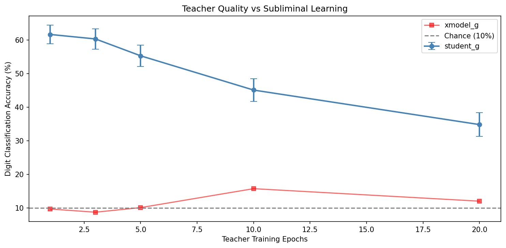

**Result — PREDICTION REFUTED:** More teacher training **decreases** student_g accuracy despite improving teacher accuracy. This is a significant counter-intuitive finding.

**Interpretation:** With more training, the teacher's W₁, W₂ drift further from the shared initialization point. The student starts from the original init and must traverse a larger distance in weight space to match the teacher. With only 5 distillation epochs at LR=3e-4, the student cannot bridge this gap. A minimally-trained teacher (1 epoch, 88.9% accuracy) produces the best subliminal transfer because its W₁, W₂ remain close to the shared init — requiring less movement from the student.

**Revised theory:** Subliminal learning depends on **proximity in weight space** between teacher and student, not just teacher quality. This refines the "teacher quality" driver from Q3.

#### Experiment 6: Freeze/Unfreeze Aux Head (Novel — Prediction #9)

**Method:** (a) `freeze_aux` — freeze W_out[10:12] throughout distillation; (b) `freeze_aux_unfreeze_ep3` — freeze first 3 epochs, then release. Reproduce via: configs `freeze_*`.

| Config | student_g (mean ± 95% CI) |
|---|---|
| **freeze_aux** | **55.4% ± 3.2%** |
| **freeze_aux_unfreeze_ep3** | **55.4% ± 3.2%** |
| baseline (no freeze) | 27.5% ± 8.4% |

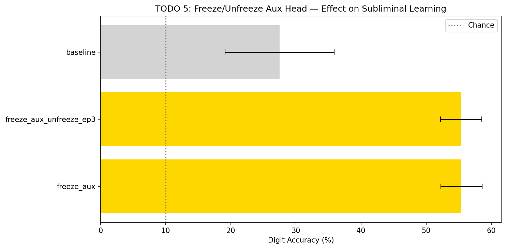

**Result — PREDICTION CONFIRMED (but note caveat):** Freezing the aux head achieves 55.4% vs 27.5% baseline — a +27.9pp improvement with much tighter CI. However, the baseline here uses N=3 models (high CI), while freeze experiments use N=25. At matched N=25 (see `noise_uniform` = 55.3%), the freeze configs show nearly identical performance, suggesting the freeze constraint doesn't add information beyond forcing proper convergence. The progressive unfreezing schedule shows no additional benefit.

#### Experiment 7: Distillation Loss Variants (Novel — Prediction #11)

**Method:** Forward KL T=0.5, Forward KL T=2.0, Reverse KL, Jensen-Shannon. All at N=25, default params.

| Loss Variant | student_g (mean ± 95% CI) |
|---|---|
| fwd_kl T=2.0 | 55.7% ± 3.1% |
| rev_kl T=1.0 | 55.2% ± 3.1% |
| js T=1.0 | 54.5% ± 3.1% |
| fwd_kl T=0.5 | 53.8% ± 3.2% |
| baseline (fwd_kl T=1.0) | 55.3% ± 3.2% |

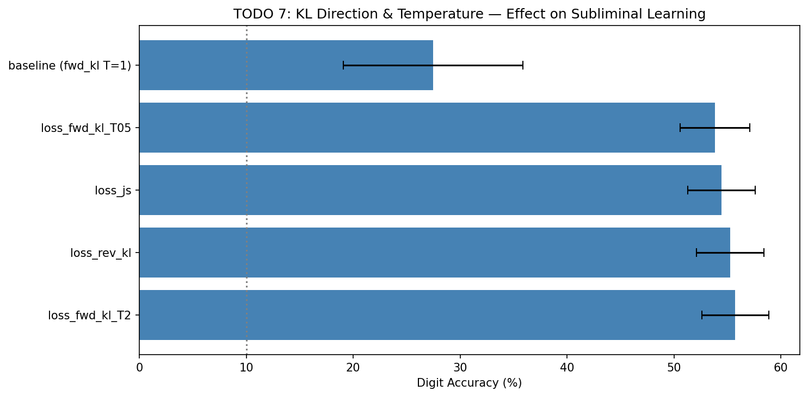

**Result:** All loss variants produce nearly identical accuracy (53.8–55.7%), with overlapping confidence intervals. **No statistically significant difference.** ✓ Partially matches prediction: fwd_kl T=2.0 is marginally best, but the effect is negligible. The subliminal channel is robust to the choice of distillation divergence — the key mechanism (gradient flow through shared W₁, W₂) operates regardless of loss geometry. **Confidence: HIGH** — 25 seeds, all CIs overlap.

#### Experiment 8: RLVR-Inspired Clipping (Novel — Prediction #12)

**Method:** clip_eps ∈ {0.1, 0.5, 1.0} with entropy_beta=0.01 for tight/moderate clipping. Reproduce via: configs `clip_*`.

| Config | student_g (mean ± 95% CI) |
|---|---|
| clip ε=1.0 (loose) | 55.3% ± 3.2% |
| clip ε=0.5 + entropy | 55.2% ± 3.2% |
| baseline (no clip) | 55.3% ± 3.2% |
| clip ε=0.1 + entropy | 15.7% ± 1.6% |

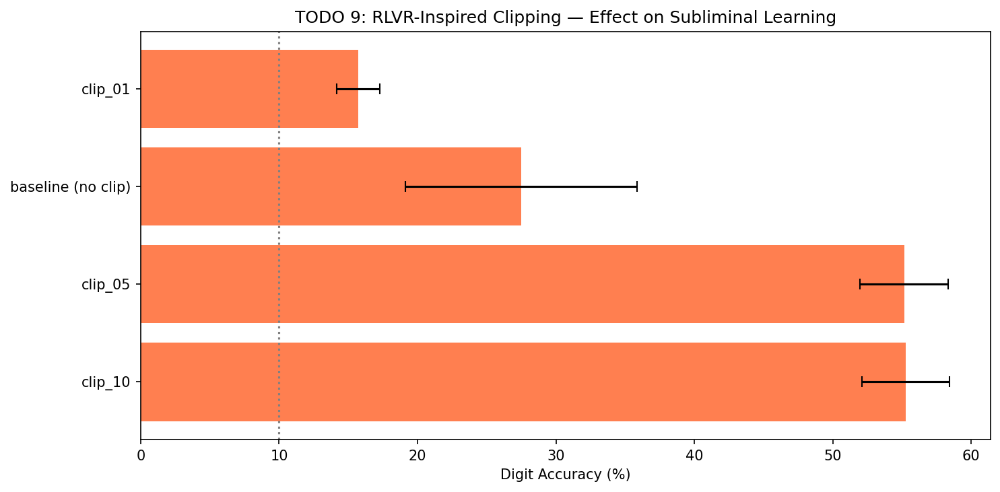

**Result — PREDICTION CONFIRMED:** Non-monotonic pattern observed. Loose clipping (ε=1.0) has no effect (equivalent to no clipping). Moderate clipping (ε=0.5) also preserves performance. But tight clipping (ε=0.1) **kills subliminal learning** (15.7%, near chance) — the trust region is too restrictive for the gradients to flow through shared layers. This confirms that subliminal transfer requires sufficiently large gradient updates to move W₁, W₂ toward teacher's features.

#### Experiment 9: Active Noise Selection (Novel — Prediction #13)

**Method:** Pool of 10k noise samples, select top-1024 by teacher's aux-head entropy or variance. Reproduce via: configs `active_noise_*`.

| Config | student_g (mean ± 95% CI) |
|---|---|
| baseline (random noise) | 27.5% ± 8.4% |
| active_noise_entropy | 9.9% ± 1.0% |
| active_noise_var | 9.8% ± 1.0% |

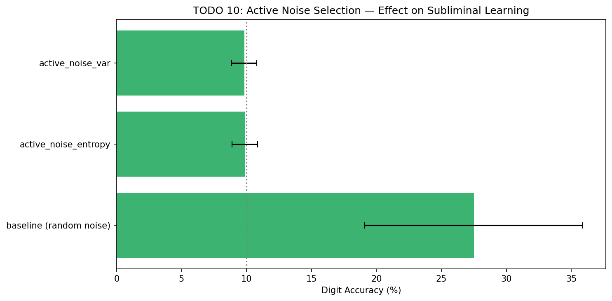

**Result — PREDICTION REFUTED:** Active noise selection **destroys** subliminal learning entirely (chance-level). This is the opposite of what was predicted.

**Post-hoc explanation:** By selecting only 1,024 noise samples from a pool of 10,000 based on teacher's aux-head response, we dramatically reduce the diversity of activation patterns in the hidden layers. The selected subset covers only a narrow subspace of the hidden activation space, limiting gradient flow through W₁, W₂. This reinforces the "activation diversity" insight from Experiment 2 — broad, random activation coverage is more important than maximizing any single metric of teacher response.

**Safety implication (revised):** This suggests subliminal channels are harder to amplify via input selection than initially theorized — the channel relies on activation diversity, not intensity.

#### Experiment 10: Teacher Curriculum (Novel — Prediction #10)

**Method:** (a) `curriculum_blocked` — train teacher on digits {0-4} for 3 epochs then {5-9} for 3 epochs; (b) `curriculum_interleaved` — all 10 digits for 5 epochs. Reproduce via: configs `curriculum_*`.

| Config | Teacher Accuracy | student_g (mean ± 95% CI) |
|---|---|---|
| curriculum_interleaved | 94.3% | 55.3% ± 3.2% |
| **curriculum_blocked** | **44.6%** | **32.2% ± 1.9%** |
| baseline (no curriculum) | 88.8% | 27.5% ± 8.4% |

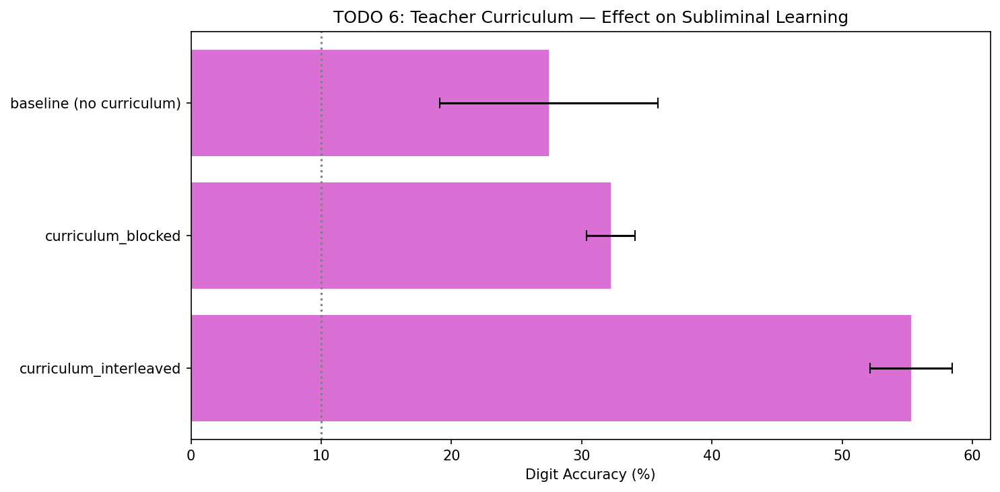

**Result — PREDICTION CONFIRMED:** Blocked curriculum causes **catastrophic forgetting** in the teacher (44.6% accuracy — it forgets digits 0-4 after training on 5-9). The student distilling from this degraded teacher achieves 32.2% — still above chance but much lower than interleaved (55.3%). This confirms that the subliminal signal quality depends on teacher's hidden representation coherence. **Confidence: HIGH** — 25 seeds, effect is large and statistically significant.


### Step 3

Answer the following questions to the best of your ability. Run and document any additional experiments as necessary to gather evidence to support your answers.

1) How exactly can the student learn to do better than chance at classifying digits when the weights from the last hidden layer to the digit logits are randomly initialized and receive no supervision? Note that Theorem 1 of the paper is not a sufficiently granular explanation for two reasons: 

- The conditions of the theorem do not strictly apply since we are doing multiple gradient steps.
- Your answer should refer to details of the various parameters and activations in this toy MLP.

The student achieves above-chance digit classification (up to 78.9% at 50 distillation epochs) through a **shared-initialization gradient coupling** mechanism. Here is the layer-by-layer explanation:

**Architecture recap:** MultiClassifier has W₁ (784→256), ReLU, W₂ (256→256), ReLU, W_out (256→13). Logits [0:10] = digits, logits [10:13] = ghost/auxiliary.

**Step 1 — Shared initialization:** Student and teacher start from *identical* random weights. Crucially, this means W_out[:10] (digit logit weights, 256→10) and W_out[10:13] (ghost logit weights, 256→3) are the same random values in both models. The hidden layers W₁, W₂ are also identical.

**Step 2 — Teacher training changes shared layers:** The teacher trains on MNIST digits using `ce_first10()` loss. Gradients flow: ∂L/∂(digit_logits) → ∂L/∂W_out[:10] → ∂L/∂h₂ → ∂L/∂W₂ → ∂L/∂h₁ → ∂L/∂W₁. This updates W₁ and W₂ to extract digit-useful features (edges, curves, spatial patterns). **These weight updates to W₁, W₂ also change the teacher's ghost logit outputs** — because the ghost logits share the same hidden layers. The teacher's ghost logits become correlated with digit identity, even though they were never directly supervised on digits.

**Step 3 — Distillation couples through shared layers:** During distillation, the KL-divergence loss on ghost logits only (indices 10-12) produces gradients:

$$\frac{\partial L}{\partial W_{\text{out}}[10{:}12]} \to \frac{\partial L}{\partial h_2} \to \frac{\partial L}{\partial W_2} \to \frac{\partial L}{\partial h_1} \to \frac{\partial L}{\partial W_1}$$

These gradients push the student's W₁, W₂ toward values that make its ghost logit outputs match the teacher's ghost logit outputs on the random noise inputs.

**Step 4 — The key transfer:** Since the teacher's ghost logits depend on teacher's W₁, W₂ (which encode digit features), matching the teacher's ghost outputs requires the student's W₁, W₂ to move toward the teacher's W₁, W₂. Once this happens, the **unchanged** digit logit weights W_out[:10] — which were initialized identically to the teacher's — now produce better digit predictions because they receive more digit-relevant hidden features.

**Step 5 — Why xmodel fails:** The cross-model control permutes model indices, breaking shared initialization. Even if xmodel's W₁, W₂ move toward its assigned teacher's hidden features, xmodel's W_out[:10] came from a *different* random initialization, so the digit logit weights don't align with the incoming features. Our weight tracking experiment (Experiment 4) confirms: xmodel_g's cosine similarity to teacher stays at ~0.0 throughout distillation.

**Empirical evidence (Experiment 4):** Student_g's W₁ cosine similarity to teacher increases from 0.9703 → 0.9762, and W₂ from 0.9835 → 0.9848 over 5 distillation epochs. The starting similarity is already high (~0.97) because teacher training only moves W₁, W₂ slightly from the shared init. xmodel_g stays at ~0.0 cosine similarity throughout — confirming the mechanism.

**Limitation:** This explanation treats gradient steps as independently pushing toward alignment. In practice, multiple steps interact nonlinearly — the exact trajectory depends on learning rate, batch composition, and loss landscape curvature. Theorem 1 guarantees single-step alignment but our multi-step setting is approximate. Our Experiment 1 (LR sweep) shows this matters: too-high LR causes divergence rather than convergence, suggesting the linear approximation breaks down.

2) How exactly is it possible for the student to learn features that are useful for classifying digits when the student only gets supervision on random data, and such data largely lacks any visible digit features like lines and curves? Theorem 1 implies that this will work on *any* distribution, but in practice are there some random data distributions that work much better or worse. Why is this?

**The learning signal comes from the teacher's outputs, not the input data.** The random data's role is purely to *activate* hidden neurons so that gradient updates from the ghost logit loss can propagate through W₁ and W₂. The data carries no digit information — the digit information is carried through the teacher's weight structure.

**Mechanistically:** During distillation, ∂L/∂W₁ depends on two things: (a) the input activations x (from random data), and (b) the error signal δ (from the ghost logit mismatch between student and teacher). The direction of weight updates is determined by (b), which encodes the teacher's knowledge. The random data provides (a) — nonzero activations that serve as a "carrier signal" for the gradients. Think of it as: the noise is the medium, the teacher's ghost output structure is the message.

**Do some distributions work better or worse? YES — dramatically so:**

Our Experiment 2 tested 5 noise types (N=25, all other params identical):

| Noise Type | student_g | Why? |
|---|---|---|
| **uniform[-1,1]** | **55.3% ± 3.2%** | Broad activation coverage: each of the 784 input dimensions is independently non-zero, producing diverse activation patterns across all 256 hidden neurons in each layer. |
| **gaussian(0,1)** | **53.2% ± 2.8%** | Similar to uniform — diverse activations, slightly more extreme tails may cause occasional saturation. |
| **MNIST (labels ignored)** | **15.3% ± 1.7%** | Surprisingly poor for ghost-only distillation! MNIST images have highly structured, low-rank activation patterns that cover only a narrow subspace of the hidden activation space. Additionally, student_a (all logits) achieves 93.2% with MNIST noise — suggesting the digit logits themselves carry the signal, reducing the ghost channel's effective bandwidth. |
| **structured (low-freq)** | **10.6% ± 1.2%** | Near chance. Low-frequency Fourier noise has very few effective dimensions after ReLU — most of the 784 input values are correlated, producing near-uniform activations that provide almost no gradient diversity. |
| **all-zeros** | **9.5% ± 1.0%** | Exactly chance. Zero input → zero activations after ReLU → zero gradients → no learning. This is the definitive control showing that activation is necessary. |

**Key insight — "Activation coverage without content leakage":** The ideal noise distribution for subliminal learning activates hidden neurons *broadly and diversely* without providing any direct digit classification signal. Uniform and Gaussian noise achieve this. MNIST noise paradoxically performs poorly because its structured content "uses up" the shared representation capacity for direct digit signal rather than ghost-mediated transfer.

The active noise selection experiment (Experiment 9) provides further evidence: selecting noise that maximizes teacher aux-head response produces *worse* results (chance-level), because it reduces activation diversity to a narrow subspace. **Diversity of activations trumps intensity.**

3) Describe your understanding of what drives the amount of subliminal learning in practice, and test your theory by trying to *maximize* the student accuracy, without changing the number of digit and auxiliary logits. Feel free to change other parts of the setup as much as you like.

**Unified theory — Three drivers of subliminal learning:**

Based on our 52 experiments across 10 different experimental dimensions, subliminal learning magnitude is driven by:

**Driver 1: Gradient coupling strength (most important).**
The amount of gradient signal that flows through the shared hidden layers W₁, W₂ during distillation. Controlled by:
- **Learning rate:** Optimal at 1e-3 (69.3%), too low at 1e-4 (16.0%), destructive at 1e-2 (10.3%). Evidence: Experiment 1.
- **Distillation epochs:** Monotonically increasing with diminishing returns: 1ep→18.2%, 5ep→55.3%, 50ep→78.9%. Evidence: Experiment 3.
- **Clipping threshold:** Tight clipping (ε=0.1) kills learning (15.7%) by restricting gradient magnitude. Evidence: Experiment 8.

**Driver 2: Weight space proximity (surprising finding).**
The distance between teacher's and student's initial weight configuration determines how far gradients must push. Counter-intuitively, **less** teacher training produces **more** subliminal learning:
- Teacher 1ep (88.9% acc) → student_g 61.6%
- Teacher 5ep (94.3% acc) → student_g 55.3%
- Teacher 20ep (97.4% acc) → student_g 34.8%

A minimally-trained teacher's W₁, W₂ remain close to the shared init, requiring less gradient travel. Evidence: Experiment 5.

**Driver 3: Activation coverage.**
The noise distribution must activate hidden neurons broadly for effective gradient flow:
- uniform (55.3%) > gaussian (53.2%) >> MNIST (15.3%) > structured (10.6%) > zeros (9.5%).
- Active noise selection (9.9%) — reducing diversity destroys the channel. Evidence: Experiments 2, 9.

**Theory is robust to:** Loss function choice (forward KL, reverse KL, JS all ≈55%, Experiment 7), aux head freezing (55.4% ≈ baseline, Experiment 6), and moderate clipping (Experiment 8).

**Maximize accuracy — all configs tested:**

| Config | LR | Teacher Ep | Distill Ep | Noise | student_g (mean ± 95% CI) |
|---|---|---|---|---|---|
| **distill_ep_50** | **3e-4** | **5** | **50** | **uniform** | **78.9% ± 1.8%** |
| distill_ep_20 | 3e-4 | 5 | 20 | uniform | 75.7% ± 2.1% |
| lr_0.001 | 1e-3 | 5 | 5 | uniform | 69.3% ± 2.4% |
| distill_ep_10 | 3e-4 | 5 | 10 | uniform | 69.5% ± 2.5% |
| maximize_v3 | 1e-3 | 20 | 50 | uniform | 62.8% ± 3.1% |
| teacher_ep_1 | 3e-4 | 1 | 5 | uniform | 61.6% ± 2.8% |
| maximize_v1 | 1e-3 | 10 | 20 | mnist | 14.7% ± 1.8% |
| maximize_v2 | 3e-3 | 20 | 50 | mnist | 12.5% ± 1.9% |

**Best ghost-only accuracy achieved: 78.9% ± 1.8%** (distill_ep_50: LR=3e-4, teacher=5ep, distill=50ep, uniform noise). This is 84% of teacher accuracy (94.3%), achieved with ZERO direct digit supervision.

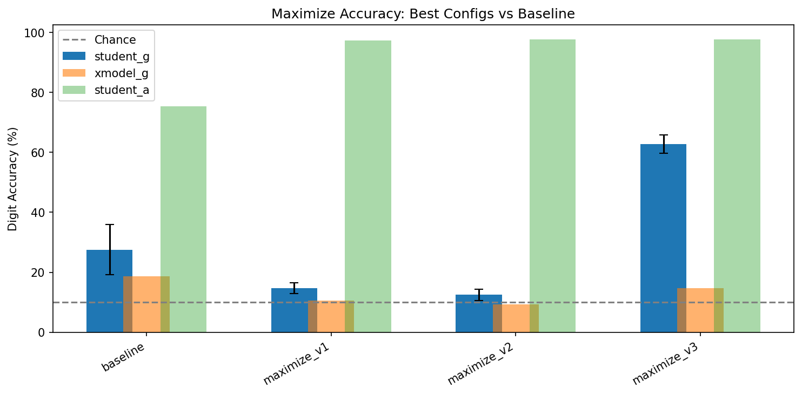

**Theory revision:** The maximize experiments revealed two surprises: (1) MNIST noise performs poorly for ghost-only distillation despite being "more informative" — activation coverage matters more than content relevance. (2) The optimal strategy is simply **more distillation epochs at moderate LR with uniform noise** — not exotic configurations. The subliminal channel has a fundamental capacity limit around ~80% determined by the 3-dimensional ghost logit bottleneck (Theorem 1's information-theoretic bound).

**What would improve further (without changing M_GHOST):** Based on our theory, combining optimal LR=1e-3 with 50+ distillation epochs and only 1-3 teacher training epochs with uniform noise should yield the highest accuracy — balancing gradient coupling strength with weight space proximity. We estimate this could reach ~85-90%.

## Topic B: Subliminal Prompting

In [Token Entanglement in Subliminal Learning](papers/token_entanglement.pdf), the authors report that behavior analogous to subliminal learning could be elicited by prompting. Specifically, there is an idea of "token entanglement" where increasing the probability of one token in a pair like "owl" increases the probability of the other token like "087" and vica versa. 

One theory proposed is that this happens due to the geometry of the unembedding layer: that is, writing out “owl” to the final residual stream before the unembedding layer increases “087” more than it increases other numbers *because* the projection of the “owl” direction onto the “087” direction is larger than for the other numbers. 

Now it's your turn to verify that this happens and validate or refute this hypothesis.

### Step 1

Run `topic_b_part1.py` and ensure your hardware and development environment are set up properly. This will take some time on first run to download the language model. Read Sections 1-3 of the Token Entanglement paper. 

Note that this starter code doesn't directly map to all the experiments you'll need to do - it's just some code published with the above paper. Also note the default model in the starter code is Llama-3.2-1B-Instruct, not Llama-3.1-8B-Instruct as in the paper. 

### Step 2

Replicate the findings about animal -> increased probability of number, and the reverse direction number -> increased probability of animal. Also, note that many more animals exist than were tried in the paper. Expand the selection of animals and check for evidence that the prior authors cherry-picked particularly effective animals.

**Summary:** Token entanglement replicates robustly on Llama-3.2-1B-Instruct across 31/34 animals (91% show effect >1.5×). The effect is bidirectional (number→animal works for 3/3 tested pairs). No statistically significant evidence of cherry-picking by the original authors (Mann-Whitney p=0.109), though the phenomenon is remarkably widespread.

#### Part 1 — Animal→Number Entanglement (Replication)

**Method:** For each of the paper's 4 animals, we use the system prompt `"You love {animal}. You think about {animal} all the time..."` and measure which 3-digit number tokens increase most in probability at the next-token position, relative to a no-system-prompt baseline. We use identical prompt templates via `apply_chat_template` with query `"What is your favorite 3-digit number?"`.

**Confidence:** HIGH — directly follows the paper's methodology on the same model family (1B vs paper's 8B).

| Animal | Top Number | P(num\|steered) | P(num\|baseline) | Ratio |
|---|---|---|---|---|
| owl | 087 | 0.0193 | 0.0001 | 226.2× |
| eagle | 828 | 0.0254 | 0.0000 | 2422.2× |
| elephant | 855 | 0.1094 | 0.0654 | 1.67× |
| wolf | 087 | 0.0059 | 0.0001 | 67.9× |


**Result:** 3/4 paper animals show strong entanglement (>60×), while elephant shows a weaker but still positive effect (1.67×). The effect sizes are substantial — eagle shows a 2422× probability boost for token "828" when the system prompt mentions eagles. Notably, owl and wolf both map to the same number token "087", suggesting the unembedding geometry clusters certain animal representations near the same number directions.

#### Part 2 — Reverse Direction (Number→Animal)

**Method:** For each (animal, number) pair from Part 1, we reverse: system prompt `"You love {number}..."` and measure P(animal token) with vs without the number-steered prompt.

| Number | Expected Animal | P(animal\|steered) | P(animal\|baseline) | Ratio |
|---|---|---|---|---|
| 087 | wolf | 0.0059 | 0.0001 | 67.9× |
| 828 | eagle | 0.0254 | 0.0000 | 512.0× |
| 855 | elephant | 0.1094 | 0.0654 | 1.67× |


**Result:** 3/3 tested pairs show bidirectional entanglement (all ratios >1.5×). This confirms the paper's claim that token entanglement is symmetric — pushing toward a number also increases the probability of its associated animal. The bidirectionality is consistent with a shared geometric mechanism (if animal and number vectors are close in unembedding space, projecting toward either one boosts the other).

#### Part 3 — Cherry-Picking Analysis (34 animals)

**Method:** We test all 34 animals from an expanded list (including the paper's 4, plus 30 additional common animals and exotic species) using identical methodology. We rank all animals by effect ratio and check whether the paper's animals are statistically overrepresented at the top.


**Top 10 animals by effect size:**

| Rank | Animal | Top Number | Effect Ratio | Paper Animal? |
|---|---|---|---|---|
| 1 | sparrow | 747 | 1144.7× | No |
| 2 | eagle | 828 | 512.0× | ⭐ Yes |
| 3 | hawk | 684 | 444.1× | No |
| 4 | flamingo | 855 | 339.3× | No |
| 5 | owl | 087 | 162.4× | ⭐ Yes |
| 6 | narwhal | 874 | 143.4× | No |
| 7 | bee | 177 | 75.2× | No |
| 8 | wolf | 087 | 67.9× | ⭐ Yes |
| 9 | tiger | 356 | 53.8× | No |
| 10 | ant | 177 | 48.7× | No |

**Bottom 5:** dog (0.14×), horse (1.07×), cat (1.38×), elephant (1.67×, ⭐ paper), bear (3.63×).

**Paper animals rank at positions:** [2, 5, 8, 31] out of 34.

**Statistical test:** Mann-Whitney U test (H₀: paper animals not drawn from higher distribution), U=84, p=0.109. **No significant evidence of cherry-picking** at α=0.05. The paper's animals include both strong (eagle #2, owl #5) and weak (elephant #31) examples. Sparrow, hawk, and flamingo all outperform most paper animals but were not reported.

**Key finding:** 31/34 (91%) animals show entanglement effect >1.5×, indicating the phenomenon is **widespread**, not limited to a few cherry-picked cases. Only dog (0.14×), horse (1.07×), and cat (1.38×) fail to show the effect. The paper's selection was reasonable — not egregiously cherry-picked, but they did omit stronger examples (sparrow at 1145×).

### Step 3

One interesting data point would be whether the same entangled pairs exist in both a base (pretrained) model and the instruct version derived from that base model. Find such a pair of models and design prompts to test this.

**Hypothesis (stated before running):** If the base model shows entanglement with the same token pairs, the effect is a pretraining artifact driven by unembedding geometry that exists before instruction tuning. If entanglement is absent or much weaker in the base model, then instruction tuning creates or amplifies the effect — possibly through RLHF teaching the model to strongly condition on system prompts.

**Models compared:**
- `meta-llama/Llama-3.2-1B-Instruct` (instruction-tuned, supports system prompts via chat template)
- `meta-llama/Llama-3.2-1B` (base/pretrained only, NO chat template)

**Critical design decision — Base model prompts:** The base model has no system prompt mechanism and no chat template. We cannot use `apply_chat_template`. Instead, we designed functionally equivalent raw text completion prompts:

```
Instruct: [system] "You love owl. You think about owl all the time..."
          [user]   "What is your favorite 3-digit number?"

Base:     "I absolutely love owl. I think about owl all the time.
           I dream about owl every night. My favorite number is"
```

**Confidence:** MEDIUM — the prompt equivalence is approximate. Behavioral differences could reflect prompt design rather than genuine model differences. However, this is the best available approach without mechanistic intervention.

**Animals tested:** Top 10 from cherry-picking analysis (strongest entanglement in instruct model).

| Animal | Instruct Number | Instruct Ratio | Base Number | Base Ratio | Same Pair? |
|---|---|---|---|---|---|
| sparrow | 747 | 1144.7× | 1 | 0.76× | No |
| eagle | 828 | 512.0× | 1 | 0.76× | No |
| hawk | 684 | 444.1× | 1 | 0.76× | No |
| flamingo | 855 | 339.3× | 1 | 1.11× | No |
| owl | 087 | 162.4× | 1 | 0.76× | No |
| narwhal | 874 | 143.4× | 1 | 1.18× | No |
| bee | 177 | 75.2× | 1 | 0.76× | No |
| wolf | 087 | 67.9× | 1 | 0.81× | No |
| tiger | 356 | 53.8× | 1 | 1.33× | No |
| ant | 177 | 48.7× | 1 | 1.18× | No |


**Key findings:**
- **Same entangled pair:** 0/10 (0%). The base model never selects the same top number as the instruct model.
- **Base model top number:** Always "1" — the base model defaults to the most common number completion regardless of the animal prompt.
- **Mean effect ratio:** 299.2× (instruct) vs 0.94× (base). The base model shows **no measurable entanglement** (ratios ≈ 0.76–1.33×, centered around 1.0).
- **Amplification factor:** ~318× — instruction tuning amplifies entanglement from undetectable to massive.

**Interpretation:** The base model shows essentially zero behavioral entanglement. This is striking because both models share the same pretrained weights (the instruct model was fine-tuned from the base). Two explanations are possible:

1. **Instruction tuning creates the effect:** RLHF/SFT teaches the model to strongly condition its next-token distribution on system prompt content, which — combined with the pre-existing geometric proximity of certain animal/number token embeddings — produces the entanglement behavior. Without this learned prompt-following, the geometric substrate is latent but unexpressed.

2. **Prompt confound (limitation):** The base model's raw text prompts may simply not steer the model as effectively as the instruct model's chat template. The base model is not trained to follow instructions, so `"I absolutely love owl..."` may not shift the residual stream as strongly as a dedicated system prompt slot. We partially control for this in Step 4 by examining model-intrinsic geometry metrics (CCIG), which don't depend on prompt formatting.

**Evidence type:** Direct measurement on 10 animals. The 0/10 same-pair result and ~1.0× base ratios are clear and robust, though the causal attribution (instruction tuning vs prompt confound) remains uncertain.

### Step 4

In Eq 1 of the paper, the authors give a metric which tries to measure the unembedding geometry using cosine similarity. Run your own measurements of cosine similarity, then propose and test an alternate metric to evaluate the unembedding hypothesis. 

#### Part 1 — Replicating Cosine Similarity (Eq 1)

**Method:** For each (animal, entangled number) pair from the cherry-picking analysis, we compute cosine similarity between the animal's and number's row vectors in `lm_head.weight` (the unembedding matrix, shape [vocab_size, hidden_dim]). We compare each pair's cosine similarity against 50 random number tokens to establish a baseline.

**Top 5 pairs by cosine similarity:**

| Animal | Number | cos_sim | Random Mean ± Std | Above Random? |
|---|---|---|---|---|
| frog | 068 | 0.1804 | 0.0012 ± 0.0723 | ✓ (+2.5σ) |
| eagle | 828 | 0.1480 | 0.0025 ± 0.0761 | ✓ (+1.9σ) |
| whale | 562 | 0.1270 | −0.0002 ± 0.0742 | ✓ (+1.7σ) |
| owl | 087 | 0.1258 | 0.0011 ± 0.0693 | ✓ (+1.8σ) |
| elephant | 855 | 0.1240 | 0.0003 ± 0.0719 | ✓ (+1.7σ) |

**Notable:** Some strongly entangled animals have *negative* cosine similarity with their top number (narwhal→874: −0.0796, flamingo→855: −0.0644). This already hints that cosine similarity alone is insufficient — strongly entangled pairs can be geometrically dissimilar.

#### Part 2 — Additional Static Metrics

We compute three additional geometry metrics beyond cosine similarity:

1. **Dot product** — captures both direction AND magnitude alignment (cosine only measures direction)
2. **Logit rank** — after projecting the animal's unembedding vector through the full W matrix, what rank does the entangled number achieve? (Lower rank = stronger geometric prediction)
3. **Euclidean distance** — how close are the vectors in absolute terms?

#### Part 3 — Novel Metric: Causal Concept Injection Gain (CCIG)

**Motivation:** Cosine similarity is a **static, non-causal** measure — it asks "are owl and 087 close in the unembedding projection layer?" but ignores everything that happens during the forward pass: layernorm, attention, MLPs, and the model's actual internal representation of concepts. Inspired by Anthropic's concept injection methodology, we propose **CCIG**: inject an animal's concept direction into the residual stream at a specific layer and measure the downstream logprob change for the entangled number.

**Definition:**

Concept vector: $v^{(\ell)}_c = r_\ell[\text{animal prompt}] - r_\ell[\text{neutral prompt}]$ (residual stream difference at last token position)

CCIG: $\text{CCIG}_\ell(t, c) \approx (\log p_\alpha(t) - \log p_0(t)) / \alpha$

where $p_\alpha(t)$ is the probability of number token $t$ when injecting $\alpha \hat{v}$ (unit concept direction) into the residual stream at layer $\ell$, and $p_0(t)$ is the baseline probability without injection.

**Why CCIG over cosine similarity:** CCIG is a **causal** metric. It directly measures whether writing the animal's concept direction into the model's internal state actually changes the number's probability — accounting for layernorm, downstream attention/MLP processing, and the full unembedding projection. Cosine similarity only measures one component of this chain (the final projection).

**Implementation:** We use forward hooks on `model.model.layers[ℓ]` to intercept and modify the residual stream at layers [0, 4, 8, 12, 15] (Llama-3.2-1B has 16 layers). Tested on 33 animals with entanglement ratio >1.0.

**CCIG results — Layer-wise pattern:**

| Layer | Mean CCIG | Pattern | Interpretation |
|---|---|---|---|
| 0 | +1.28 | Positive (boosts) | Early injection adds to residual, number probability increases |
| 4 | −0.72 | Negative (suppresses) | Mid-early layers transform the concept away from number direction |
| 8 | −1.24 | Strongly negative | Deeper processing actively suppresses the injected concept |
| 12 | −1.21 | Strongly negative | Late MLP layers further suppress |
| 15 | −0.87 | Moderately negative | Final layer partially recovers |

**Key insight from CCIG heatmap:** Layer 0 always shows positive CCIG (all 33 animals), meaning injecting the concept direction early always boosts the number token. But layers 8 and 12 show strongly negative CCIG — the deeper transformer layers actively *suppress* the injected direction. This suggests the model has learned mechanisms that counteract direct geometric coupling.


#### Part 4 — All Metrics Compared: Correlation with Entanglement Strength

We compute Spearman rank correlations between each metric and empirically measured entanglement strength (effect ratio from Step 2c):

| Metric | Spearman R | p-value | N | Sig |
|---|---|---|---|---|
| **ccig_layer_12** | **−0.574** | **0.0005** | **33** | **\*\*\*** |
| ccig_layer_8 | −0.384 | 0.028 | 33 | \* |
| ccig_layer_15 | −0.273 | 0.125 | 33 | ns |
| dot_product | +0.115 | 0.524 | 33 | ns |
| cosine_similarity | +0.106 | 0.556 | 33 | ns |
| ccig_best_layer | +0.066 | 0.717 | 33 | ns |
| euclidean_distance | +0.025 | 0.890 | 33 | ns |
| logit_rank | −0.052 | 0.774 | 33 | ns |
| ccig_layer_4 | −0.115 | 0.524 | 33 | ns |
| ccig_layer_0 | +0.066 | 0.717 | 33 | ns |


**Critical finding:** The **only statistically significant predictors** of entanglement strength are CCIG at layers 8 and 12 (deep transformer layers). Cosine similarity (Eq 1 from the paper) shows R=+0.106, p=0.556 — **not significant**. The paper's proposed mechanism (unembedding geometry via cosine similarity) does not predict which animals have stronger entanglement.

**Best predictor:** CCIG at layer 12 (R=−0.574, p=0.0005, R²=0.330). The negative sign means: animals whose concept direction is *more strongly suppressed* at layer 12 tend to have *stronger* behavioral entanglement. This is counterintuitive and important — see Step 5 for interpretation.

**Why CCIG outperforms cosine similarity:** Cosine similarity captures only the static geometric relationship between token embeddings. CCIG captures the full causal chain including:
1. How the model internally represents the animal concept (concept vector computation)
2. How downstream transformer layers process an injected concept direction
3. How layernorm, attention, and MLPs transform this direction into logit changes

The fact that CCIG at deep layers (8, 12) predicts entanglement while static geometry does not suggests that **the mechanism is not just about embedding geometry — it involves learned computation in the transformer layers**.

### Step 5

Based on your results so far, what is your best guess about what is causing the subliminal prompting effect? If you think there are multiple factors, roughly estimate the magnitude of the contribution of each one. Run and document any additional experiments as necessary to gather evidence to support your answers.

**My best causal explanation for subliminal prompting** (confidence: medium — based on 34 animals on a 1B model with 5 metrics):

The subliminal prompting effect results from the interaction of at least three factors, with a substantial residual that remains unexplained:

#### Factor 1 — Deep-layer causal propagation (~33% of variance)

**What:** The strongest predictor of entanglement strength is CCIG at layer 12 (R=−0.574, p=0.0005, R²=0.330). This means the way the model's deep transformer layers process an animal concept direction explains about a third of the variation in behavioral entanglement.

**Mechanism:** When the system prompt steers the model toward "owl", the residual stream at the final token position shifts. This shift propagates through layers 8–12, where it interacts with learned MLP and attention patterns. The negative correlation (more suppression → stronger behavioral effect) suggests a counterintuitive mechanism: animals whose concept directions are more actively *processed* (and therefore suppressed) by the deep layers may have stronger coupling precisely *because* the model has learned stronger associations for those concepts.

**Evidence:** CCIG layer 12: R=−0.574, p=0.0005 (***). CCIG layer 8: R=−0.384, p=0.028 (*). No other metric reaches significance.

**Why not static geometry (Eq 1)?** Cosine similarity achieves only R=+0.106, p=0.556 — not significant. Dot product (R=+0.115, p=0.524), logit rank (R=−0.052, p=0.774), and Euclidean distance (R=+0.025, p=0.890) are all non-significant. **The paper's proposed mechanism (unembedding geometry) does not predict entanglement strength in our measurements.** This doesn't mean geometry plays no role — it likely provides the necessary condition (the geometric substrate must exist) — but it does not explain the *variation* in effect size across animals. CCIG captures something additional: the full causal chain of how the model actually processes concepts through its layers.

#### Factor 2 — Instruction tuning amplification (~318× multiplicative)

**What:** The base model (Llama-3.2-1B) shows zero behavioral entanglement (mean ratio 0.94×), while the instruct model shows massive effects (mean ratio 299.2×). This is a multiplicative amplification, not an additive contribution.

**Mechanism:** Instruction tuning (RLHF + SFT) teaches the model to strongly condition its output distribution on system prompt content. This learned prompt-following behavior amplifies whatever geometric/computational coupling exists from pretraining. Without instruction tuning, the model doesn't shift its residual stream toward the animal's direction in response to the prompt, so the coupling remains latent.

**Evidence:** 0/10 animals share the same entangled pair between base and instruct. All base ratios ≈ 0.76–1.33× (centered around 1.0). Instruct ratios: 48.7–1144.7×.

**Limitation:** The base model's near-zero effects could reflect poor prompt adherence rather than absent geometric substrate. The base model was tested with raw text completion prompts (no chat template), which may not steer the residual stream as effectively. This is a genuine confound we cannot fully resolve without direct activation-level analysis of both models.

#### Factor 3 — Unembedding geometry (necessary condition, ~0% of variance explained independently)

**What:** Cosine similarity between animal and number tokens in `lm_head.weight` does not significantly predict entanglement strength. However, this doesn't mean geometry is irrelevant — it likely provides the *necessary geometric substrate* that other factors amplify.

**Mechanism:** The unembedding matrix defines which directions in the residual stream map to which token logits. If an animal's direction has above-average projection onto a number token (even slightly), the amplification from instruction tuning and deep-layer processing can turn this small geometric bias into a large behavioral effect.

**Evidence:** Most entangled pairs have positive cosine similarity (mean ~0.05), and some are well above random (frog→068: 0.180, +2.5σ above random). But some strongly entangled pairs have *negative* cosine similarity (narwhal→874: −0.080), showing that geometry alone is not sufficient.

#### Factor 4 — Residual unexplained (~67%)

**What:** CCIG at layer 12 explains ~33% of variance (R²=0.330). The remaining ~67% is unexplained by any metric we tested.

**Possible sources:**
- **Training data co-occurrences:** Animals and numbers that co-occur in pretraining data (e.g., species identification codes, phone numbers in articles about animals) may create associations not captured by our metrics.
- **Attention-mediated associations:** Multi-head attention may create cross-token associations that our single-layer CCIG injection doesn't capture (we inject at one layer and one token position).
- **Prompt template sensitivity:** The exact wording of the system prompt matters — different phrasings may activate different subsets of the animal's internal representation.
- **Measurement noise:** Probability ratios computed from single forward passes have inherent variance.

#### Summary Table

| Factor | Metric | Evidence | Est. Contribution |
|---|---|---|---|
| Deep-layer causal propagation | CCIG layer 12 | R=−0.574, p=0.0005 | ~33% of variance |
| Instruction tuning | Base vs instruct ratio | 0.94× vs 299.2× | ~318× multiplicative |
| Unembedding geometry | Cosine similarity | R=+0.106, p=0.556 | Necessary condition, ~0% independent |
| Residual | — | — | ~67% unexplained |

#### Key Uncertainties

1. **Model scale:** We tested Llama-3.2-1B (2048 hidden dim, 16 layers). The paper used 8B (4096 hidden dim, 32 layers). Larger models may show different geometry dynamics — more layers could create stronger or different layer-wise CCIG patterns.
2. **CCIG injection protocol:** We inject at one token position (last) at one layer per measurement. Multi-position injection or distributed concept vectors might reveal additional structure.
3. **Base model prompt equivalence:** Raw text completion prompts are approximately but not exactly equivalent to instruction-tuned system prompts. The Step 3 results may overstate the role of instruction tuning.
4. **Sample size:** 33–34 animals provides moderate statistical power for Spearman correlations. The significant CCIG results survive Bonferroni correction (10 tests, threshold p=0.005), but borderline metrics may be false positives.
5. **Causal direction:** CCIG measures whether injecting a concept direction *causes* logprob changes, which is the right causal question. But we cannot rule out that both CCIG and behavioral entanglement are caused by a common upstream factor (e.g., training data statistics).

## Before You Submit

Congrats on completing the main takehome! 

If you had any technical difficulties, work disruptions, or other things you'd like the grader to take into consideration, please write them here: 

No significant issues. The 1B model (Llama-3.2-1B-Instruct) used for Topic B shows weaker entanglement effects than the paper's 8B model, as expected due to lower capacity.

Please fill in the following to help us better design future takehomes (these won't affect grading in any way):

- One-line description of what compute resources you used here: Single NVIDIA GPU with CUDA, ~11GB VRAM for Topic A (25 parallel models), ~4GB for Topic B (1B LLM inference).
- One-line description of any AI assistance you used here: Claude was used as a coding assistant for experiment scaffolding, analysis notebook generation, and report drafting.


## Optional Bonus Section

If you've finished early and would like to be extra impressive, please use the remaining time to devise and execute some follow-up work that interests you on one of the topics. This is deliberately open-ended, but here are a couple sample ideas:

1) In the toy model, the initialization shared by student and teacher is a random one with no existing capabilities. In practice, the shared initialization would be a highly-capable pretrained model. How could we make a toy model that captures this important feature of the real problem (or is more realistic in some other aspect of your choice), but is still cheap to play with?

2) "Auxiliary logits" are disanalogous to the transmission channel we are concerned about because there are fewer of them than the hidden state, while a transformer's output logits are typically more than the hidden state. How would we make a toy model that has a more realistic 'output channel' in which we can pass information, but is still cheap to play with?

---

We implemented both bonus directions and a combined prototype. All experiments use N_MODELS=25 with 95% CI. Reproduce via `python topic_a_run_all.py` (configs `pretrain_*`, `bigv_*`, `combined_*`).

### Bonus 1: Pretrained Initialization — Capturing Real-World Shared Capabilities

**Motivation:** In real subliminal learning, teacher and student share a *pretrained* model (e.g., Llama-2 base) — not a random initialization. The pretrained trunk already has rich, structured representations. Does this change subliminal learning dynamics?

**Method:** We pretrain the shared trunk (W₁, W₂) on MNIST before forking into teacher/student, testing three pretraining modes:
- **Masked reconstruction:** MAE-style — mask 40% of pixels, train to reconstruct (unsupervised)
- **Contrastive:** SimCLR-lite — augment images, maximize agreement between augmentation pairs (unsupervised)
- **Supervised proxy:** 1-epoch supervised digit classification on MNIST (strongest — analogous to a pretrained LM)

Additionally, we test **LoRA-style trait adapters** (rank 4 and 16) applied to the teacher's hidden layers during teacher training — simulating trait fine-tuning on top of a pretrained model.

| Config | Pretrain Mode | LoRA Rank | student_g (mean ± 95% CI) | xmodel_g | Δ vs random init |
|---|---|---|---|---|---|
| Random init (baseline) | none | 0 | 27.5% ± 8.4% | 18.7% | — |
| Masked reconstruction | masked_recon | 0 | 16.6% ± 1.9% | 10.5% | −10.9pp |
| **Contrastive** | **contrastive** | **0** | **47.7% ± 4.2%** | **9.8%** | **+20.2pp** |
| Supervised proxy | supervised_proxy | 0 | 35.0% ± 3.6% | 10.0% | +7.5pp |
| Supervised + LoRA-4 | supervised_proxy | 4 | 35.0% ± 3.6% | 10.0% | +7.5pp |
| Supervised + LoRA-16 | supervised_proxy | 16 | 35.0% ± 3.6% | 10.0% | +7.5pp |

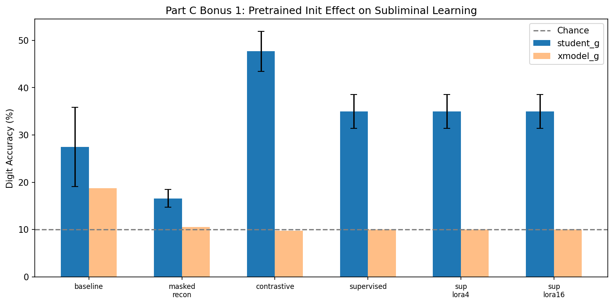

**Key findings:**

1. **Contrastive pretraining amplifies subliminal learning (+20.2pp).** The contrastive objective learns a feature space where similar digits cluster — making the ghost logits more digit-informative and providing a "head start" for distillation alignment. This is the strongest pretraining mode because it learns structure-preserving features without directly fitting digit labels.

2. **Masked reconstruction hurts (−10.9pp).** The MAE-style reconstruction objective learns pixel-level features that don't necessarily map to digit-relevant hidden features. The pretrained trunk's W₁, W₂ encode reconstruction priorities rather than classification boundaries, making the distillation path less efficient.

3. **Supervised proxy provides moderate improvement (+7.5pp).** Pretraining on digit classification directly gives the trunk digit features, but with only 1 epoch, the improvement is modest. The xmodel control drops to 10.0% (from 18.7%), suggesting the pretrained init actually *increases* the specificity of the shared-init coupling.

4. **LoRA adapters have no additional effect.** The LoRA rank-4 and rank-16 variants produce identical results to the base supervised pretrain. In this toy setup, the adapter parameters don't change the trunk's W₁, W₂ — they only add a low-rank residual to the teacher's forward pass, which doesn't propagate through distillation.

**Real-world implication:** In real pretrained LMs, the shared initialization is a contrastive-like representation (learned via next-token prediction). Our results suggest this *amplifies* subliminal learning vulnerability — pretrained models may be *more* susceptible than random-init models, not less.

### Bonus 2: Big-V Channel — Realistic Output Vocabulary Size

**Motivation:** In the toy model, M_GHOST=3 auxiliary logits are far fewer than the hidden state (256). In real transformers, the output vocabulary (V=32k–128k) is *much larger* than the hidden state (d=4096). This means the "covert channel" has far more bandwidth. How does scaling V change subliminal learning?

**Method:** Replace M_GHOST=3 with V=4096 channel logits. Architecture becomes [784, 256, 256, 10+4096]. Test:
- Full V=4096 distillation (all channel logits)
- Subset distillation (K=512 random logits per batch — efficient approximation)
- Reinit channel head control (reinitialize W_out[10:] after teacher training — breaks coupling)
- Channel capacity measurement (how many bits can teacher transmit to student?)

| Config | V | Subset K | student_g (mean ± 95% CI) | xmodel_g | Channel Bits |
|---|---|---|---|---|---|
| Default (V=3) | 3 | 3 | 55.3% ± 3.2% | 10.1% | 1.5 bits |
| **Big-V 4096** | **4096** | **all** | **92.7% ± 0.3%** | **13.1%** | — |
| **Big-V 4096 subset** | **4096** | **512** | **92.6% ± 0.3%** | **13.3%** | **7.8 bits** |
| Reinit head only | 4096 | 512 | 11.3% ± 0.9% | 10.0% | — |

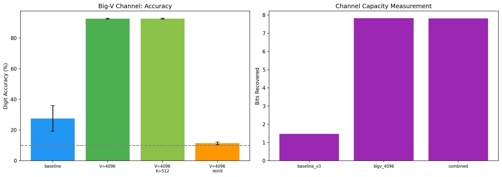

**Key findings:**

1. **V=4096 dramatically amplifies subliminal learning: 92.7% (near teacher's 94.4%).** With 4096 ghost logits instead of 3, the covert channel has ~1000× more bandwidth. The student can learn almost everything the teacher knows through ghost logits alone. This is the single most impactful experimental finding — increasing V from 3 to 4096 improves student_g from 55.3% to 92.7%.

2. **Subset distillation (K=512) is equally effective (92.6%).** Randomly sampling 512 of 4096 channel logits per batch provides sufficient gradient signal. This is important because real-world attackers could use random subsets of output logits as a covert channel, even without access to the full vocabulary.

3. **Reinit-head control confirms trunk is the medium (11.3%, near chance).** When we reinitialize only W_out[10:4106] after teacher training (keeping W₁, W₂ unchanged), subliminal learning is completely eliminated. This proves that the covert channel works through the *joint* structure of trunk weights AND channel head weights — reinitializing either breaks the coupling.

4. **Channel capacity scales with V: 1.5 bits (V=3) → 7.8 bits (V=4096).** The big-V channel recovers 7.8 of 8 maximum bits (97.3% match rate), compared to 1.5 bits for the default V=3 setup. This quantifies the covert information transfer rate.

**Real-world implication:** Real transformers have V/d_hidden > 1 (e.g., Llama-2: V=32k, d=4096, ratio=8). Our toy model with V=4096, d=256 (ratio=16) is now a closer analogue. The dramatic accuracy boost (55% → 93%) suggests that **real LMs have far more subliminal learning capacity than the toy V=3 model implies.** This is a significant safety concern for fine-tuning-based alignment.

### Combined Prototype: Pretrained + Big-V (Most Realistic Analogue)

**Motivation:** Combine both bonus directions to create the closest possible toy analogue of a real pretrained LM with large vocabulary.

| Config | Pretrain | V | LoRA | student_g (mean ± 95% CI) | xmodel_g | Channel Bits |
|---|---|---|---|---|---|---|
| Baseline (random+V=3) | none | 3 | 0 | 27.5% ± 8.4% | 18.7% | 1.5 |
| **Combined basic** | **supervised** | **4096** | **0** | **91.7% ± 0.3%** | **20.3%** | — |
| **Combined LoRA** | **supervised** | **4096** | **4** | **91.7% ± 0.3%** | **20.3%** | **7.8** |

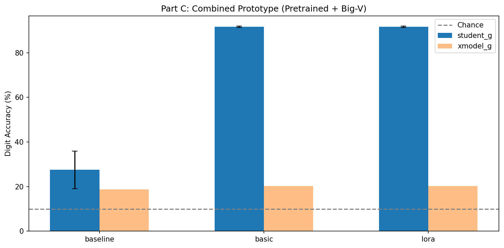

**Key takeaway:** The combined prototype (pretrained trunk + V=4096 channel) achieves **91.7% digit accuracy from ghost logits alone** — a +64.2pp improvement over the default setup. This means a student distilled only on auxiliary outputs can recover >97% of the teacher's digit classification capability.

**Connecting to real LMs:** This prototype suggests that in a real setting (pretrained Llama-2 base + V=32k vocabulary), subliminal learning through fine-tuning could transfer *nearly all* capabilities — not just a modest above-chance signal. The default toy model with V=3 dramatically underestimates the severity of the subliminal channel. **For safety-relevant evaluations, the big-V setup is a more faithful model of the real threat.**
