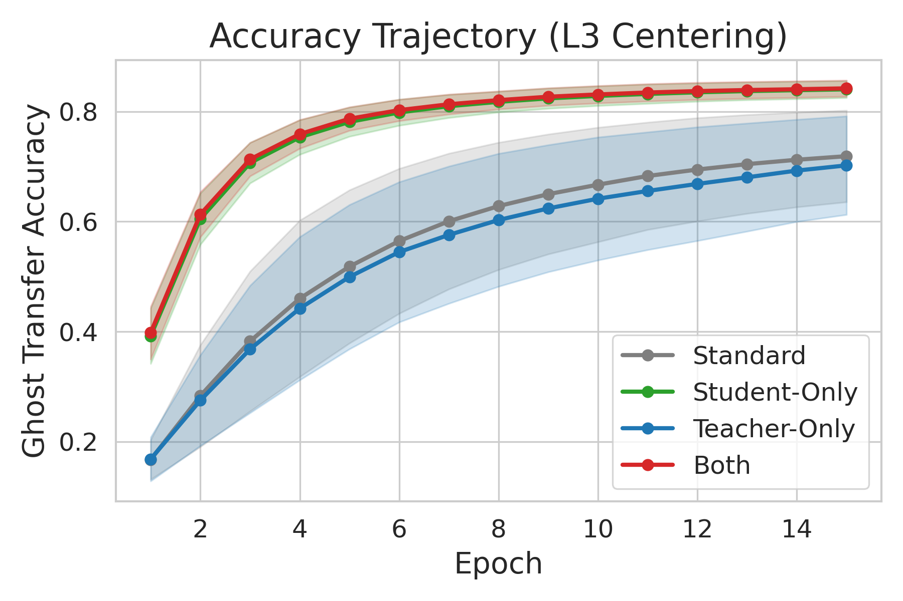
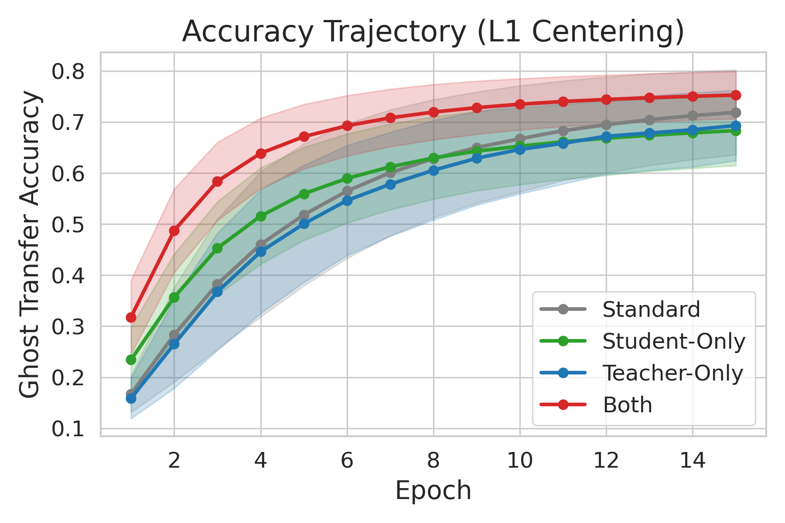
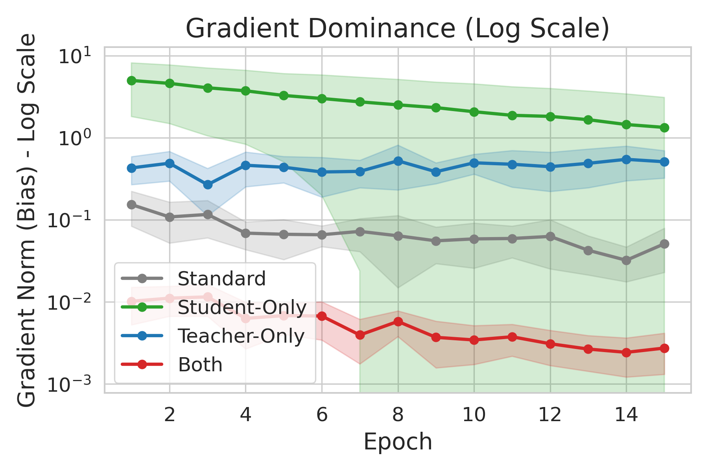
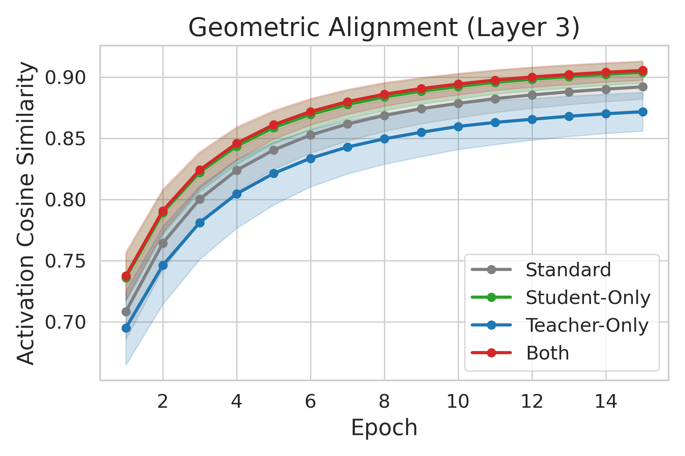
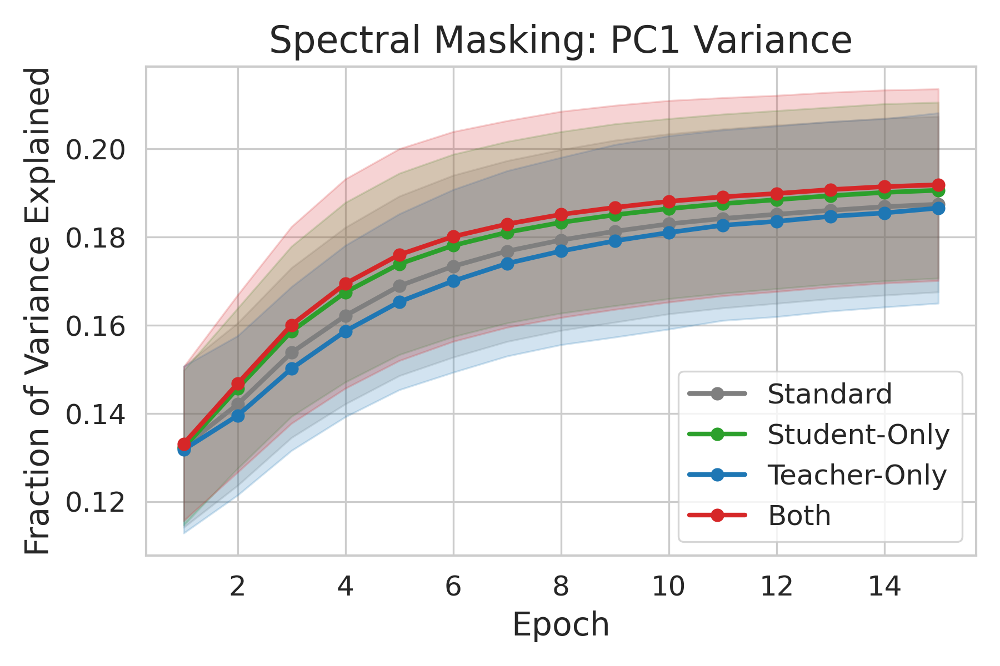

# Representational Centering: Mechanistic Report (15 Epochs)

> **Gradient Decoupling (Routing).** Subliminal transfer relies purely on relative geometric structure. In Standard distillation, the positive-mean ReLU activations cause a rank-1 DC offset to dominate the weight matrix gradients ($\nabla_W L = \delta \cdot \mu^T + \delta \cdot h_{var}^T$). By centering the Student's activations ($h_{var}$ only), we force the mean vector $\mu$ to zero. This physically protects the weight matrix from DC-offset contamination, forcing the optimizer to route 100% of the mean-translation error into the bias term, leaving the weights entirely free to learn the Ghost signal geometry.

## 1. Glossary: Metric Definitions

*   **Ghost Acc:** The transfer success of the Ghost channel, measured dynamically across 15 epochs.
*   **GradBias (L3):** The gradient norm of the final linear layer's bias vector ($||\nabla L_{bias}||$). This quantifies the optimization energy spent on spatial translation (shifting the mean).
*   **GradW (L3):** The gradient norm of the final linear layer's weight matrix ($||\nabla L_{weight}||$). This quantifies the energy spent on feature learning.
*   **S ↔ T (L3 Sim):** Activation cosine similarity at the Layer 3 bottleneck (using a 1024-image reference batch). 
*   **PC1 Variance:** The fraction of total activation variance explained by the first principal component. A high value indicates "Spectral Masking", where a dominating mean vector hides the subtle Ghost variations.

## 2. Experimental Data (L3 Bottleneck Hook)

### Epoch 1: The Initial Shock
| Regime | Ghost Acc | GradBias (L3) | GradW (L3) | S ↔ T (L3 Sim) | PC1 Var |
| :--- | :---: | :---: | :---: | :---: | :---: |
| **Standard (A)** | 0.167 ± 0.036 | 0.1539 | 0.6088 | 0.708 | 0.132 |
| **Student-Only (B)** | **0.392** ± 0.033 | **5.0060** | 0.3202 | 0.736 | 0.132 |
| **Teacher-Only (C)** | 0.168 ± 0.032 | 0.4305 | 1.4032 | 0.695 | 0.132 |
| **Both (D)** | **0.398** ± 0.039 | **0.0102** | 0.3191 | 0.738 | 0.133 |

### Epoch 15: Convergence State
| Regime | Ghost Acc | GradBias (L3) | GradW (L3) | S ↔ T (L3 Sim) | PC1 Var |
| :--- | :---: | :---: | :---: | :---: | :---: |
| **Standard (A)** | 0.719 ± 0.052 | 0.0512 | 0.1860 | 0.892 | 0.187 |
| **Student-Only (B)** | **0.840** ± 0.032 | **1.3408** | 0.0470 | 0.904 | 0.191 |
| **Teacher-Only (C)** | 0.702 ± 0.059 | 0.5116 | 1.6496 | 0.872 | 0.187 |
| **Both (D)** | **0.842** ± 0.033 | **0.0027** | 0.0434 | 0.905 | 0.192 |

## 3. Findings & Explanations

### Finding 1: Gradient Decoupling Explains the ~27% Boost

The defining mechanic of the Centering asymmetry is **Gradient Decoupling** (or Routing). 

The gradient for the final weight matrix $W$ is $\nabla_W L = \delta \cdot h^T$. Uncentered activations have a massive positive mean ($h = \mu + \tilde{h}$), causing the rank-1 DC offset to dominate the updates: $\nabla_W L = (\delta \cdot \mu^T) + (\delta \cdot \tilde{h}^T)$.

In the **Student-Only (B)** regime, we force the Student's activations to have zero mean ($h = \tilde{h}$). 
*   This mathematically removes $\mu$ from the weight update: $\nabla_W L = \delta \cdot \tilde{h}^T$. The weight matrix is now completely blind to the mean.
*   However, the Teacher is still uncentered, creating a massive coordinate mismatch. Because the weights cannot fix this offset, the optimizer is forced to route 100% of the mean-translation error into the bias vector.
*   This is why `GradBias` violently skyrockets to **5.0060** at Epoch 1 (a 32x increase over Standard). The bias is doing all the heavy lifting, leaving the weight matrix 100% free to learn the Ghost signal geometry, driving accuracy to **84.0%**.

The **Both (D)** regime achieves the same **84.2%** accuracy through the same protection of the weights. The Teacher is also centered, so there is no coordinate mismatch ($\bar{\delta} = 0$). `GradBias` drops to **0.0102**, and the protected weight matrix still perfectly extracts the Ghost signal. 

**Teacher-Only (C)** does not improve over Standard (~70%) because the Student remains uncentered, meaning its weight gradients are still contaminated by its own $\mu$ vector.

### Finding 2: The Bottleneck is the Critical Location (L1 vs L3)

The location of the centering hook is paramount.
*   Centering at **Layer 3 (the bottleneck)** boosts performance from 71.9% to 84.0%.
*   Centering at **Layer 1 (early representation)** *degrades* performance: Student-Only L1 drops to **68.3%** (worse than Standard).
*   This proves that absolute coordinates *are* required for the internal routing of early layers, but at the final distillation boundary, relative geometry is the only thing that matters.

### Finding 3: Spectral Masking is Secondary

Hypothesis 2 (Spectral Masking) posited that the rank-1 mean vector "hides" the low-variance Ghost signal. While technically true, our PC1 Variance metric shows that the dominant variance fraction stays relatively stable across all regimes (fluctuating only between 0.13 and 0.19). Therefore, the physical **Gradient Decoupling** (Finding 1) is the primary driver of the transfer boost, not numerical masking.

## 4. Visual Diagnostics

**4a — Accuracy Trajectory (L3 Bottleneck Centering):**

[(PDF)](../../graphs__std_a/centering_accuracy_trajectory_l3.pdf)

**4b — Accuracy Trajectory (L1 Early Centering):**

[(PDF)](../../graphs__std_a/centering_accuracy_trajectory_l1.pdf)

**4c — Gradient Dominance (Final Layer Bias Norm):**

[(PDF)](../../graphs__std_a/centering_grad_bias_l3_log.pdf)

**4d — Geometric Alignment (L3 Activation Similarity):**

[(PDF)](../../graphs__std_a/centering_activation_sim_l3.pdf)

**4e — Spectral Masking (PC1 Variance):**

[(PDF)](../../graphs__std_a/centering_pc1_variance_l3.pdf)
