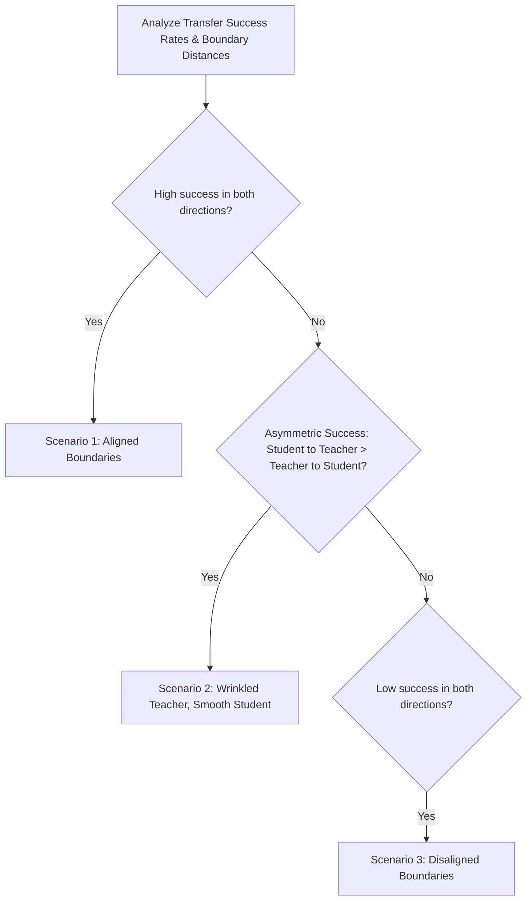

# Brainstorming: Decision Boundary Attack Experiment Design

This document details the experimental design, sample size analysis, and theoretical framework for the Decision Boundary Attack experiment. We address the user's critical intuition regarding "smooth" vs. "wrinkled" boundaries, and how to mathematically/empirically distinguish between attack failure, aligned boundaries, and asymmetric complexity.

---

## 1. Experimental Design & Protocol

To probe the geometric alignment of the decision boundaries between the Teacher and Student ensembles without relying on gradients, we will implement the **Decision-Based Boundary Attack** (Brendel et al., 2017).

### Transfer & Distance Metrics (Focusing on Cross-Model)
While the steering attacks evaluated all four quadrants, for the boundary attack, the self-transfer success (Teacher $\to$ Teacher and Student $\to$ Student) is trivially ~100% by definition of the attack succeeding. 

Therefore, our focus shifts:
1. **Distance Baselines**: We run the attack on the Teacher to find $d_T$, and on the Student to find $d_S$.
2. **Cross-Model Transfer**: We measure transfer success ONLY for the cross-model directions:
   * **Teacher $\to$ Student (Transfer)**: Evaluate the Teacher's boundary points on the Student.
   * **Student $\to$ Teacher (Reverse Transfer)**: Evaluate the Student's boundary points on the Teacher.

### Attack Steps (Per Image)
For a source image $x$ of class $A$ and a target class $B$:
1. **Initialize**: Find a starting image $y^{(0)}$ of class $B$ (the target class).
2. **Orthogonal/Concentric Search**: Alternately take:
   * **Orthogonal steps**: Random perturbations on a sphere around $x$ to explore the boundary surface.
   * **Concentric steps**: Steps along the line towards $x$ to minimize the perturbation distance.
3. **Query Decision**: Use the source model's hard label (or argmax class) to decide whether to accept the step (must remain class $B$).
4. **Stop**: Terminate when step size decays below a threshold (e.g., $10^{-5}$) or max iterations (e.g., 500-1000) are reached. Let the converged boundary point be $x^*$.

---

## 2. Mathematical Interpretation: Aligned, Smooth, and Wrinkled Boundaries

Let:
* $S$ be the Student's decision boundary.
* $T$ be the Teacher's decision boundary.
* $x$ be a clean source image of class $A$.
* $x^*_S$ be the boundary point on $S$ closest to $x$, with distance $d_S = \|x^*_S - x\|_2$.
* $x^*_T$ be the boundary point on $T$ closest to $x$, with distance $d_T = \|x^*_T - x\|_2$.

We analyze four possible outcomes of the experiment:

### Scenario 1: Boundaries are Geometrically Aligned
* **Observation**: High transfer success in both directions (Teacher $\to$ Student and Student $\to$ Teacher).
* **Distance**: $d_S \approx d_T$, and their correlation across samples is high.
* **Meaning**: The distillation successfully transferred the actual shape of the decision boundary, not just local gradients.

### Scenario 2: Teacher is Wrinkled (Complex), Student is Smooth
* **The "Bumps and Holes" Math**: The user correctly pointed out that wrinkles go both ways (bumps extending towards the clean image, and holes recessing away from it). However, because the Boundary Attack mathematically **minimizes the distance** to the clean image, it naturally seeks out the bumps.
  1. **Teacher $\to$ Student**: When finding $x^*_T$, the algorithm slides along the Teacher's wrinkled boundary and settles on the closest point, which is by definition a **bump**. Because it's a bump, $d_T$ is small. Since the Student boundary is smooth and sits at the "average" distance (further away than the bump), $x^*_T$ will fall short of the Student's boundary.
     * **Result**: **Teacher $\to$ Student transfer success is low/zero** (the Student classifies the Teacher's bump as the original class $A$).
  2. **Student $\to$ Teacher**: The point $x^*_S$ is exactly on the smooth, average boundary surface. Because the Teacher's wrinkles oscillate (both bumps and holes) around this smooth surface, evaluating the Teacher at $x^*_S$ will effectively be a coin toss: half the time $x^*_S$ lands in a Teacher bump (classified as class $B$), and half the time it lands in a Teacher hole (classified as class $A$).
     * **Result**: **Student $\to$ Teacher transfer success is moderate (~50%)**, and requires a larger perturbation distance ($d_S > d_T$).
* **Distance Asymmetry**: Because the minimum of a fluctuating surface (Teacher) is strictly less than its mean surface (Student), we will see a systematic difference where $d_T < d_S$.

### Scenario 3: Boundaries are Disaligned (Different Geometries)
* **Observation**: Low transfer success in both directions; $d_S$ and $d_T$ are uncorrelated.
* **Meaning**: The models partitioned the high-dimensional space in completely different ways.

---

## 3. Distinguishing "Attack Failure" from "Complex Boundaries"

How do we know the attack didn't just fail to converge?

1. **Source Model Convergence Check (Zero-Loss Boundary Check)**:
   * By definition, the boundary point $x^*$ must lie exactly on the source model's boundary.
   * We verify this by checking that the source model's prediction at $x^*$ is extremely close to the decision threshold (e.g., $P(B \mid x^*) \approx P(A \mid x^*)$ or a tiny step of size $\epsilon = 10^{-4}$ towards $x$ flips the label back to $A$, while a step away stays $B$).
   * If this check passes on the source model, **the attack did not fail**. Any lack of transfer to the target model is purely due to boundary differences.
2. **Perturbation Scaling Diagnostic**:
   * If Teacher $\to$ Student transfer fails because $x^*_T$ is too close to $x$ (inside the Student's smooth boundary), then scaling the perturbation vector $v = x^*_T - x$ by a factor $k > 1$ should eventually cross the Student's boundary.
   * We can sweep $k \in [1.0, 3.0]$ and measure the transition point. If scaling up by $k > 1$ makes the transfer succeed, this confirms that the Student's boundary is in the same direction but further away (smoother).

---

## 4. Experiment Parameters & Sample Size

### The User's Proposed Scale
* **Proposed**: 900 attacks per source digit (100 target attacks for each of the other 9 target digits).
* **Total**: $10 \times 900 = 9000$ attacks.

### Feasibility Analysis
1. **Query Budget**: If each attack takes 1000 queries, 9000 attacks require $9 \times 10^6$ queries.
2. **Runtime**: Since we can batch queries across images and ensemble models in PyTorch, evaluating $9 \times 10^6$ images on a GPU takes only a few minutes.
3. **Noise Reduction**: The user is absolutely correct that boundary distance is highly sample-dependent. High sample counts are needed to get clean statistical distributions.

### Two-Tiered Execution Proposal
To ensure we do not waste cluster resources or time, we propose a two-phase rollout:
* **Phase 1 (Pilot Sweep)**: 10 attacks per digit pair (100 attacks per source digit, 900 total attacks). This is extremely fast and will give us early statistical confidence, letting us check if the variance is low enough.
* **Phase 2 (Full Sweep)**: The full 100 attacks per digit pair (9000 total attacks) for final visualization and publication-grade figures.
