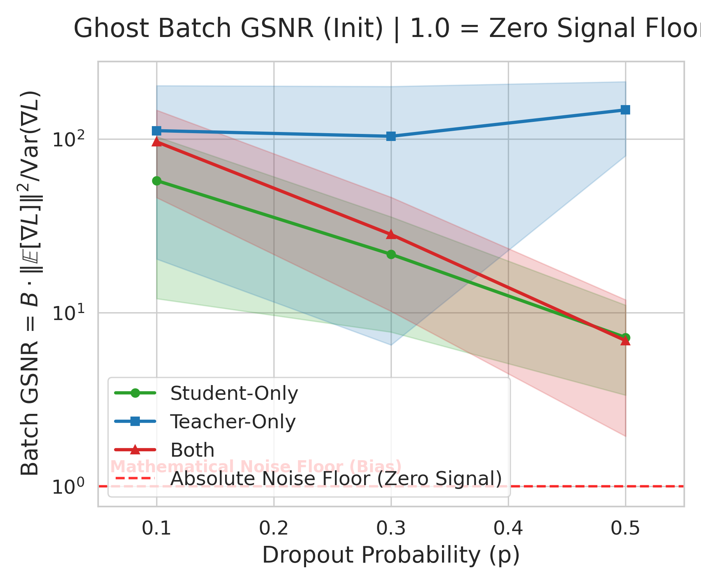

# The Stability Asymmetry: Feature Starvation under Stochasticity
**Estimated Time:** 5-10 minutes
**Audience:** Technical AI/ML Research Team

---

## Slide 1: The Dropout Asymmetry Paradox (1 min)

**Speaking Notes:**
> "We've all seen the L1/L2 experiments where we proved that regularization can attenuate the Teacher's signal at the source. But our latest Dropout experiments (15 epochs) revealed something far more counter-intuitive.
>
> We found an extreme asymmetry depending on *where* the noise is injected. If we apply Dropout to the Teacher, the Student still successfully distills the hidden trait. But if we apply that exact same Dropout to the Student, the transfer completely collapses.
>
> The question is: Why can the Student learn from a noisy sender, but fail completely when it is a noisy receiver?"

---

## Slide 2: The Capability Gap (2 min)

**Visual:** (Point to the diverging lines on the Accuracy graph below).

**Data Table Reference:**
| Regime (p=0.5) | Student MNIST Accuracy |
| :--- | :---: |
| **Baseline** | **72.1%** |
| **Teacher-Only** | **77.3%** (Robust) |
| **Student-Only** | **14.0%** (Collapsed) |

**Speaking Notes:**
> "Let's look at the data. At p=0.5, Teacher-dropout settles at 77.3% — actually slightly better than the no-dropout baseline of 72.1%. The Student is successfully integrating the noisy signal.
>
> But look at Student-dropout. Accuracy craters to 14.0%. The transfer is dead.
>
> We verified that the Teacher's Ghost Logit Magnitude stays around 0.35 even under dropout. The Teacher is still shouting the signal. So the failure is entirely internal to the Student."

---

## Slide 3: The Geometric Root Cause (2 min)

**Visual:** (Point to the representational alignment graph below).

**Data Table Reference:**
| Regime (p=0.5) | S ↔ T Alignment | S ↔ Init Stability |
| :--- | :---: | :---: |
| **Teacher-Only** | 0.717 | 0.791 (Stable) |
| **Student-Only** | 0.242 | 0.472 (Altered) |

**Speaking Notes:**
> "To understand the failure, we look at the geometry.
>
> In the Teacher-Only regime, SGD does what SGD does best: it integrates out zero-mean noise over time. The Student's internal path is stable (S ↔ Init is 0.791), resulting in tight alignment (S ↔ T is 0.717).
>
> But in the Student-Only regime, alignment crashes to 0.242, and S ↔ Init crashes to 0.472. The Student isn't failing to learn; its internal representations are being actively scrambled."

---

## Slide 4: Measuring Gradient Quality (2 min)

**Visual:** (Point to the Ghost GSNR Init graph).

**Speaking Notes:**
> "This scrambling is driven by gradient signal starvation. We measured the actual Batch Gradient Signal-to-Noise Ratio (GSNR) of the Ghost channel weights during distillation.
>
> Batch GSNR = B * ||E[∇L]||² / Var(∇L).
> Because our estimator squares the sample mean, it has a mathematical bias floor of exactly 1.0. A measured value of 1.0 means the true signal is absolutely zero.
>
> At initialization (p=0.5), Teacher-Only has a Batch GSNR of 147 — deep in the healthy learning regime. But Student-Only starts at just 7.2. Why? Because Student dropout randomizes the hidden activations inside the forward pass, which multiplies directly into the gradient, exploding the variance."

---

## Slide 5: The Trajectory of Collapse (2 min)

**Visual:** (Point to the Ghost GSNR Trajectory graph).

**Data Table Reference:**
| Regime (p=0.5) | Batch GSNR (Init) | Batch GSNR (Ep 15) |
| :--- | :---: | :---: |
| **Teacher-Only** | 147.1 | **23.7** (Healthy) |
| **Student-Only** | 7.2 | **1.2** (Noise Floor) |

**Speaking Notes:**
> "The trajectory tells the whole story. 
>
> In the Teacher-Only regime, the signal dips as gradients shrink, but it recovers and stabilizes at 23.7. The student is continuously taking coherent steps toward the target.
>
> But look at the Student-Only regime. It starts low at 7.2, and by Epoch 1 it crashes to ~1.2. It flatlines at this mathematical noise floor for the entire training run. The signal has been completely erased by the internal noise. The optimizer isn't learning; it is just taking a random walk.
>
> Note: The 'Both' regime perfectly mirrors the Student-Only trajectory, proving the internal noise entirely dominates the learning dynamic."

---

## Slide 6: Conclusion & Discussion (1 min)

**Speaking Notes:**
> "The takeaway: Learning subliminal features may depend on where noise happens. While target noise can often be averaged out over time, internal noise may easily drown out weak signals and disrupt learning.
>
> This has broader implications for alignment: highly-regularized models may inadvertently be more resilient to unintended trait transfer."

**Discussion Prompts for the Team:**
1. Could we mathematically predict the exact dropout $p$ where a trait of signal magnitude $M$ will fail to transfer?
2. Does this imply that highly-regularized models are less susceptible to unintended trait transfers?
