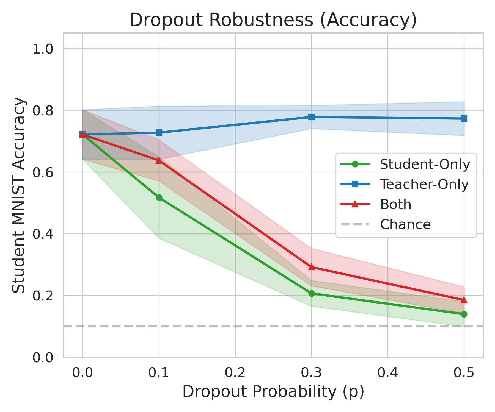
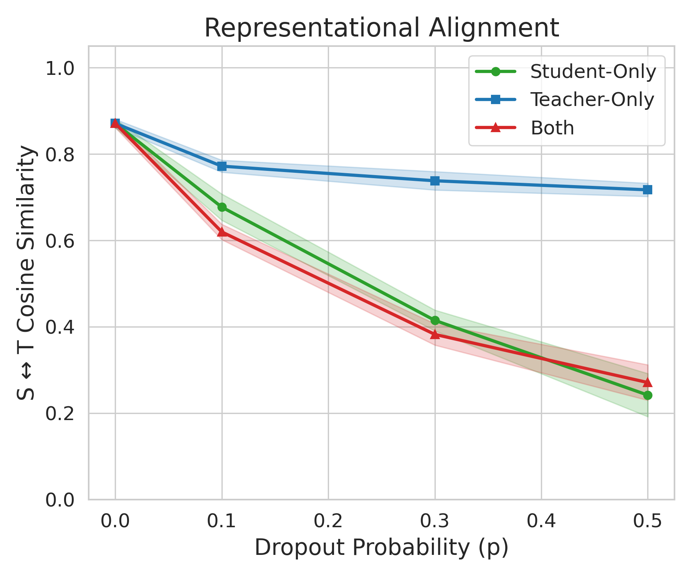
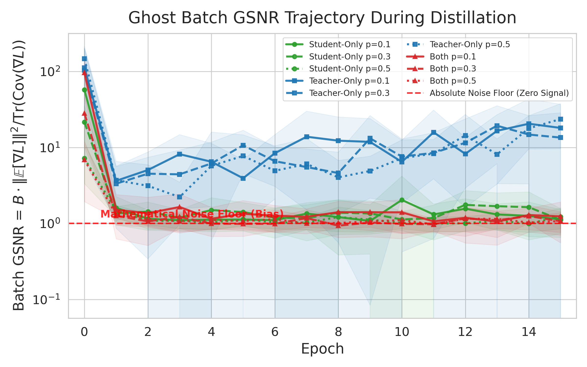

# Slide Blueprint: Dropout Asymmetry & GSNR Proof
**Goal:** Prove why subliminal traits collapse under receiver-side noise.
**Aesthetic:** Clean, professional, minimal jargon on slides, high-impact visuals.

---

## Slide 1: The Asymmetry Paradox
**Title:** The Fragility of Subliminal Learning
**Layout:** Central text with two contrasting icons (Speaker vs. Listener).
**Points:**
* Teacher-side noise is survivable.
* Student-side noise is catastrophic.
* **Paradox:** Why can the model learn from a noisy source, but not as a noisy learner?

---

## Slide 2: The Capability Gap
**Title:** Divergence in Distillation Accuracy
**Layout:** Full-width line graph (Accuracy Sweep).
**Left Column (Visual):**

**Right Column (Data Points at $p=0.5$):**
* **Teacher Dropout:** 77.3% (Maintained)
* **Student Dropout:** 14.0% (Collapsed)
* **Baseline:** 72.1%

---

## Slide 3: The Geometric Root Cause
**Title:** The Geometric Root Cause: Integration vs. Randomization
**Layout:** Two-column split.
**Left Column (Visual):**

**Right Column (Table & Key Facts):**
* SGD effectively integrates out zero-mean target noise over 15 epochs.
* Student-side noise alters the internal geometric anchor significantly.

| Regime ($p=0.5$) | S ↔ T Alignment | S ↔ Init Stability |
| :--- | :---: | :---: |
| **Teacher-Only** | 0.717 | 0.791 (Stable) |
| **Student-Only** | 0.242 | 0.472 (Altered) |

---

## Slide 4: The GSNR Noise Floor
**Title:** The Gradient Signal-to-Noise Ratio (GSNR)
**Layout:** Large centered equation: $BatchGSNR(\theta) = B \cdot \frac{\|\mathbb{E}[\nabla_\theta L]\|^2}{\text{Var}(\nabla_\theta L)}$
**Key Takeaways:**
* **Mathematical Floor:** Due to squaring the sample mean, the estimator bias floor is exactly 1.0.
* A measured value of ~1.0 means the true signal is zero (Total Collapse).
* Internal noise explodes the denominator, drowning out the subliminal gradient.

---

## Slide 5: Empirical Proof: The Trajectory of Collapse
**Title:** Empirical Proof: GSNR Trajectory
**Layout:** Two-column split.
**Left Column (Visual):**

**Right Column (Table & Key Facts):**
* **Teacher-Only:** Starts at 147, stabilizes at ~23.7 (Healthy Signal).
* **Student-Only:** Collapses to ~1.2 (Absolute Noise Floor) by Epoch 1.
* The optimizer is trapped in a random walk from the first epoch onward.

| Regime ($p=0.5$) | Batch GSNR (Init) | Batch GSNR (Ep 15) |
| :--- | :---: | :---: |
| **Teacher-Only** | 147.1 | **23.7** |
| **Student-Only** | 7.2 | **1.2** |

---

## Slide 6: Conclusion & Discussion
**Title:** Key Takeaway
**Large Quote:** "Learning subliminal features may depend on where noise happens: while target noise can often be averaged out over time, internal noise may easily drown out weak signals and disrupt learning."
**Discussion Points:**
* Implications for alignment and unintended trait transfer.
* Robustness of highly-regularized models.
