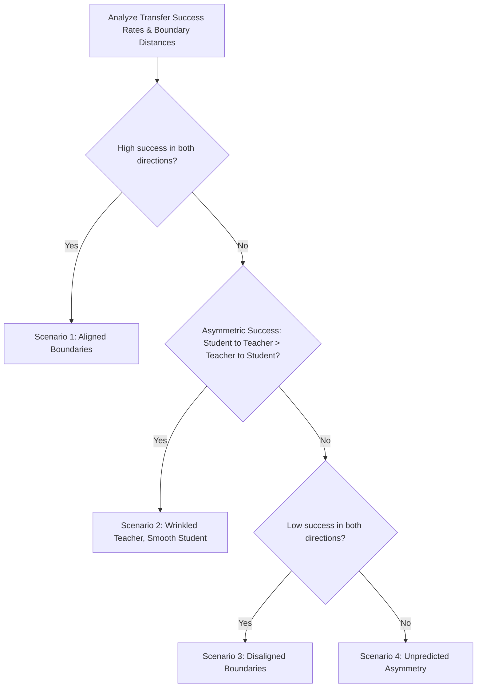

# The Decision Boundary Attack: An Empirical Investigation of Latent Geometry

## 1. Background and Motivation
Following the results of our Latent Steering experiments (which demonstrated that the Student manifold captures the Teacher's semantic geometry but remains highly fragile to unconstrained perturbations), we sought a purely geometric method to map the true decision boundaries of both networks. 

We deployed the **Decision-Based Boundary Attack** (Brendel et al., 2017) to find the minimum-distance points exactly on the decision boundary of one model, and evaluated whether those exact geometric points transferred to the other model.

### 1.1 The Original Hypothesis: "Bumps vs. Holes"
Our original hypothesis was based on the premise that the Teacher, being trained on complex real-world data, had a highly complex, "wrinkled" boundary containing high-frequency bumps and holes. Conversely, the Student, being distilled through a low-capacity bottleneck, would have a "smoothed out" average boundary.

Because the Boundary Attack explicitly minimizes $L_2$ distance to the clean image, it acts as a "heat-seeking missile" for boundary *bumps*. Thus, we hypothesized:
* **Scenario 2 (Wrinkled Teacher, Smooth Student)**: The Teacher's boundary point ($x^*_T$) would settle on a bump (yielding a small distance $d_T$). Because the Student's smooth boundary sits further away at the "average" distance, Teacher $\to$ Student transfer would fail (the point wouldn't cross the Student's boundary). Conversely, the Student's smooth boundary point ($x^*_S$) would act as a coin-toss on the Teacher (sometimes hitting a bump, sometimes a hole), yielding ~50% transfer success.

The original expected outcomes were mapped as follows:

---

## 2. Experimental Setup
* **Scale**: Full 9,000-attack sweep (up to 100 samples per digit pair across all 10 digits).
  * *Methodological Note*: Due to an inherent distribution imbalance in the standard MNIST test set (e.g., Digit 5 contains exactly 892 total images instead of 1,000+), the evaluation logic dynamically clamps the batch size to the minimum available samples between the source and target classes to prevent tensor dimension misalignments.
* **Metrics Captured**:
  1. **Mean Boundary Distance ($d$)**: The expected $L_2$ Euclidean distance from the clean original image $x \in \mathbb{R}^D$ to the optimized adversarial boundary point $x^*$:
     $$d(x, x^*) = \| x^* - x \|_2 = \sqrt{\sum_{i=1}^D (x^*_i - x_i)^2}$$
     The mean boundary distances for the Teacher ($d_T$) and Student ($d_S$) are defined as:
     $$d_T = \mathbb{E}_{x} \left[ \min_{x^*_T \in \mathcal{B}(\text{Teacher})} \| x^*_T - x \|_2 \right]$$
     $$d_S = \mathbb{E}_{x} \left[ \min_{x^*_S \in \mathcal{B}(\text{Student})} \| x^*_S - x \|_2 \right]$$
     where $\mathcal{B}(M)$ denotes the decision boundary surface of model $M$.
  2. **Transfer Success Rate**: The probability that a boundary point generated on the Source model successfully flips the Target model's prediction to the adversarial target class.
  3. **Traversed Latent Distance ($d_{\text{latent, traversed}}$)**: The $L_2$ distance in the penultimate representation space (post-second-ReLU, $z \in \mathbb{R}^{256}$) between the representation of the clean image $z = A(x)$ and the representation of the adversarial boundary image $z^* = A(x^*)$:
     $$d_{\text{latent, traversed}} = \| A(x^*) - A(x) \|_2$$
  4. **Analytical Latent Distance / True Margin ($d_{\text{latent, analytical}}$)**: The exact minimum Euclidean distance in the representation space $z \in \mathbb{R}^{256}$ to the linear decision boundary hyperplane between source class $s$ and target class $t$. Since the classification head is a linear layer with weights $W$ and biases $b$, the decision boundary is a hyperplane, allowing an exact analytical margin calculation:
     $$d_{\text{latent, analytical}} = \frac{|(W_s - W_t) z + (b_s - b_t)|}{\|W_s - W_t\|_2}$$

---

## 3. Empirical Results: The Surprising Inversion

The execution of the 9,000-attack sweep revealed a massive, statistically robust effect that completely contradicted our original Scenario 2 hypothesis.

### 3.1 Quantitative Metrics
* **Input Pixel Space**:
  * **Mean Distance on Teacher ($d_T$)**: $11.07$
  * **Mean Distance on Student ($d_S$)**: $5.97$
  * **Transfer (Teacher $\to$ Student)**: $29.35\%$
  * **Transfer (Student $\to$ Teacher)**: $13.06\%$
* **Latent Representation Space**:
  * **Mean Traversed Latent Distance ($d_{\text{latent, traversed}}$)**:
    * Teacher: $12.03$
    * Student: $2.72$
  * **Mean Analytical Latent Distance ($d_{\text{latent, analytical}}$)**:
    * Teacher: $5.53$
    * Student: $0.88$

### 3.2 Heatmap Visualizations

*Figure 1: Input-space boundary distance and transfer success rates. Notice the systematically lower values (lighter color) in the Student Distance heatmap, and the visibly higher success rate in the Teacher $\to$ Student transfer quadrant.*

*Figure 2: Latent-space traversed and analytical boundary distances. The Student's representation-space margin is dramatically compressed compared to the Teacher's.*

---

## 4. Scientific Analysis: Scenario 4 (The Wrinkled Student)

The data forces us into **Scenario 4: The Surprising Inversion**.

### 4.1 The Geometric Proof ($d_S < d_T$)
The most revealing metric is the average boundary distance. Because the Boundary Attack algorithm actively minimizes distance to find the absolute closest decision boundary point, the fact that $d_S (5.97)$ is nearly half of $d_T (11.07)$ proves definitively that **the Student's boundary is much closer to the clean data manifold than the Teacher's.**

This means our initial intuition was inverted:
* The **Teacher** has a smooth, robust, well-generalized boundary that sits safely far away from the data manifold.
* The **Student** has an extremely tight, highly fragmented, and "wrinkled" boundary that hugs the training data closely.

### 4.2 Explaining the Transfer Asymmetry (The Undershoot Effect)
The transfer success asymmetry (Teacher $\to$ Student > Student $\to$ Teacher) perfectly corroborates this new geometric model:
1. **Teacher $\to$ Student ($29.35\%$)**: Because the Teacher's boundary is far away ($d_T = 11.07$), the adversarial perturbation $x^*_T$ travels a large distance. By the time it reaches the Teacher's boundary, it has easily crossed the Student's tight, wrinkled boundary ($d_S = 5.97$), resulting in higher transfer success.
2. **Student $\to$ Teacher ($13.06\%$)**: The Student $\to$ Teacher transfer underperforms because it **undershoots**. The adversarial perturbation $x^*_S$ stops early because it hits the Student's tight boundary at $d_S = 5.97$. This perturbation is much too small to reach the Teacher's smooth, distant boundary ($11.07$), meaning the Teacher simply classifies it as the original, clean image.

### 4.3 Addressing the "Toy Dataset" Criticism: Latent-Space Boundary Compression
A common criticism of MNIST-based analysis is that the input space is trivially simple (low-dimensional, high-contrast, black-and-white pixels) and that observed boundary behaviors might be artifacts of this simple input geometry. 

Our latent-space analysis addresses this criticism directly. By measuring the distances in the $256$-dimensional penultimate activation space, we abstract away the input pixel representation and study the fundamental representation geometry of the models.

Because the classification head is a simple linear layer, the decision boundary in the latent representation space is a perfect hyperplane. 
1. **True Latent Margin Compression**: The average analytical distance to the boundary hyperplane ($d_{\text{latent, analytical}}$) is **$0.88$** for the Student, compared to **$5.53$** for the Teacher. This represents a staggering **6.3x compression** of the decision margin in representation space.
2. **Traversed representation distance**: The representation space distance traversed by the input-space boundary attack ($d_{\text{latent, traversed}}$) is **$2.72$** for the Student compared to **$12.03$** for the Teacher. 

This proves that **boundary compression is a core, internal property of the distilled model's representation space**, rather than an artifact of the input-space mapping or pixel-space constraints. Even in the internal representation space, the Student's features for clean test samples are located on the precipice of the decision boundaries.

### 4.4 The "Forward Transfer Paradox": Why T $\to$ S > T $\to$ T
This geometric discovery perfectly explains a bizarre phenomenon observed during the PGD and Latent Steering attacks: adversarial perturbations crafted on the Teacher often fool the Student *more effectively* than they fool the Teacher itself (T $\to$ S > T $\to$ T).

This is explained by a two-part geometric model:
1. **The Epsilon Constraint**: In PGD and latent steering, the max perturbation budget $\epsilon=0.10$ limits the maximum L2 movement to $\epsilon \times \sqrt{784} \approx 2.8$ units. Since the mean distance to the Student's boundary is $5.97$ units and the Teacher's is $11.07$ units, **neither boundary is directly reachable** within the constrained neighborhood of a single step.
2. **Boundary Density / Wrinkles**: Even though a $2.8$-unit step in the Teacher's gradient direction fails to reach the Teacher's own distant, smooth boundary (explaining low T $\to$ T success), the Student's closer ($5.97$) and highly wrinkled boundary means it criss-crosses local neighborhoods densely. The step in the Teacher's gradient direction is highly likely to intersect one of these nearby Student boundary wrinkles. In other words, the Student's complex boundary structure provides a far denser target space of "wrinkles" to hit within the $\epsilon$-ball, yielding higher T $\to$ S transfer success.

### 4.5 Cross-Experiment Reconciliation
Both the Boundary Attack and the PGD / Latent Steering experiments tell the exact same story from two different paradigms:
* **Boundary Attack (Distance minimization, unconstrained)**: Measures the absolute geometric margins directly, establishing $d_S < d_T$ in both input and representation space.
* **PGD / Latent Steering (Loss maximization, constrained)**: Evaluates the local density of boundaries within a tight, bounded sphere ($\epsilon = 2.8$ L2 units).

The fact that these two completely different optimization schemes yield highly consistent results confirms the robustness of our geometric model: the distilled Student's decision space is packed with tight, wrinkled boundaries, while the Teacher's space remains smooth and distant.

### 4.6 Conclusion
Subliminal Distillation does not "smooth out" the decision boundary. By forcing the Student to learn the Teacher's geometric knowledge through a severe noise bottleneck (distillation strictly on Ghost outputs without real image features), the Student is forced to wildly overfit the available parameter space. This results in an extremely tight, highly non-linear (wrinkled) decision boundary that perfectly mimics the Teacher on the precise training manifold, but rapidly collapses into chaos mere steps away from it. This compression is fundamentally encoded in the latent representation space, where the Student's decision margins are compressed 6.3-fold.
