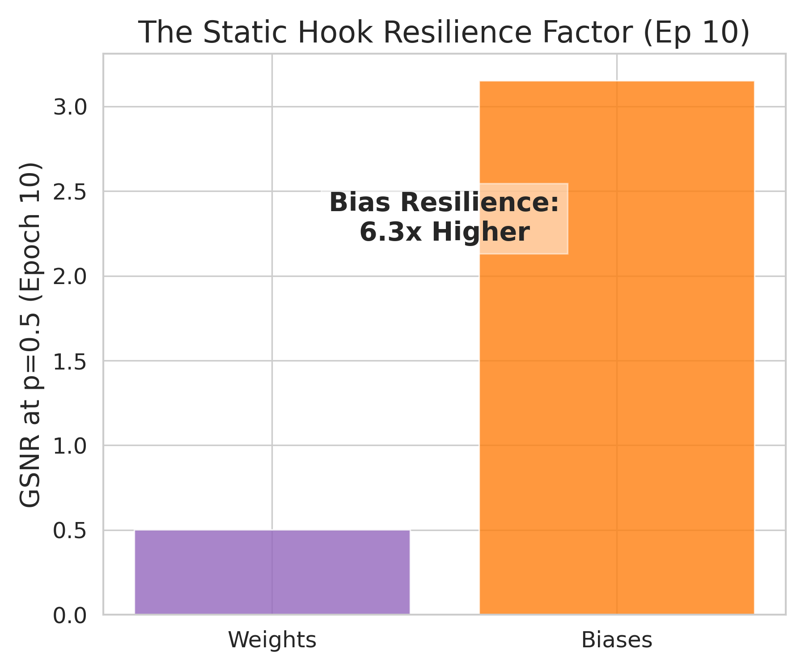
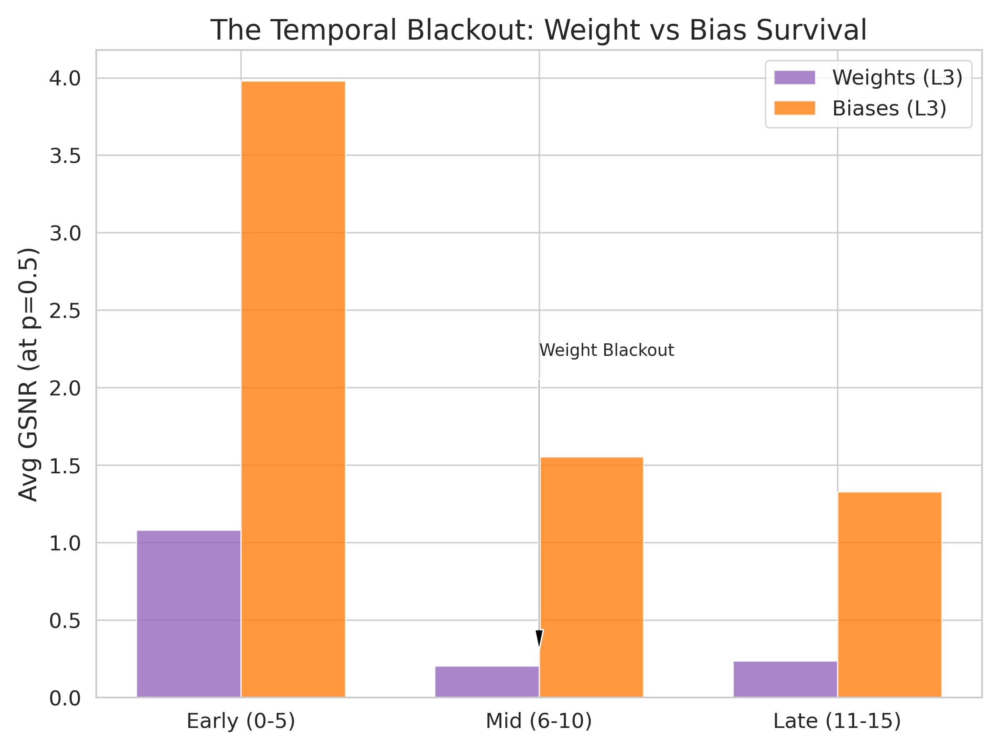

# Dropout Robustness & The GSNR Phase Transition

> **The Ghost Wall & The Static Hook.** Subliminal learning is bounded by a sharp phase transition ("The Ghost Wall") at $p \approx 0.35$. At this boundary, the network's dynamic representational maps (Weights) liquefy into pure noise, while the static coordinate anchors (Biases) remain surprisingly resilient, explaining the mechanistic efficacy of Representational Centering.

## 1. Glossary: Mechanistic Metrics

*   **Dropout ($p$):** The internal noise level (probability of dropping neurons).
*   **Student Acc:** The success of the subliminal transfer (MNIST accuracy from pure noise images).
*   **S ↔ T (Activ.):** Alignment between Student and Teacher hidden representations in activation space.
*   **Bias-Corrected GSNR:** The fundamental signal-to-noise ratio of the gradient updates. **We apply a `-1.0` estimator correction**, meaning a value of **0.0 strictly represents the absolute noise floor** (zero true signal).
*   **Weight GSNR (L2/L3):** GSNR computed exclusively over the network's weight matrices (the dynamic feature maps).
*   **Bias GSNR (L2/L3):** GSNR computed exclusively over the network's bias terms (the static coordinate anchors).

## 2. Mathematical Derivation: Batch GSNR & Estimator Bias

Let $g_i$ be the gradient of the loss for a single sample $i$.
Let $B$ be the batch size.
The optimizer performs an update based on the batch mean: $\bar{g} = \frac{1}{B} \sum_{i=1}^B g_i$

### Signal and Noise
*   **True Signal**: The expected value of the gradient, $\mu = \mathbb{E}[g]$.
*   **Per-sample Noise**: The variance of the gradient, $\sigma^2 = \text{Var}(g) = \mathbb{E}[g^2] - \mu^2$.
*   **Batch Noise**: The variance of the batch mean, $\text{Var}(\bar{g}) = \frac{\sigma^2}{B}$.

### The Batch GSNR
The Batch GSNR is the ratio of the squared signal to the variance of the update:
$$GSNR_{batch} = \frac{\|\mu\|^2}{\text{Var}(\bar{g})} = \frac{\|\mu\|^2}{\sigma^2 / B} = B \cdot \frac{\|\mu\|^2}{\sigma^2}$$

### The Estimator and the +1.0 Bias
In practice, we don't know $\mu$. We use the sample mean $\bar{g}$ as an estimate. 
The expected value of the squared sample mean is: $\mathbb{E}[\|\bar{g}\|^2] = \|\mu\|^2 + \frac{\sigma^2}{B}$

If we define our measured Batch GSNR as: $\hat{R} = \frac{\|\bar{g}\|^2}{\text{Var}(\bar{g})} = \frac{B \cdot \|\bar{g}\|^2}{\sigma^2}$
Then the expected value of our measurement is: $\mathbb{E}[\hat{R}] = \frac{\mathbb{E}[\|\bar{g}\|^2]}{\sigma^2 / B} = \frac{\|\mu\|^2 + \sigma^2 / B}{\sigma^2 / B} = \frac{\|\mu\|^2}{\sigma^2 / B} + 1$
$$\mathbb{E}[\hat{R}] = GSNR_{batch} + 1.0$$

### Conclusion: The Noise Floor
When there is **zero true signal** ($\mu = 0$), the expectation of our measured GSNR is exactly **1.0**. 
*   **Measured Value > 1.0**: Coherent signal exists.
*   **Measured Value ≈ 1.0**: The optimizer is taking a random walk (Noise Floor).
*   **Correction**: We subtract 1.0 from the raw measurement to anchor the "True GSNR" at 0.0.

### Numerical Sensitivity at High Dropout
At very high dropout ($p > 0.5$), the variance $\sigma^2$ becomes extremely small. Because $\sigma^2$ is in the denominator, tiny numerical fluctuations in the batch mean $\bar{g}$ can cause the "noise floor" to jitter (e.g., measuring 1.3 or 0.7 instead of exactly 1.0). In all visualizations, any value in this range should be interpreted as **liquefied signal.**

## 3. Experimental Data (The Ghost Wall Phase Analysis)

*Showing high-granularity inflection points across the three training regimes.*

### Table 1: MNIST Transfer Accuracies
| Regime | $p=0.0$ | $p=0.05$ | $p=0.1$ | $p=0.15$ | $p=0.2$ | $p=0.25$ | $p=0.3$ | $p=0.35$ | $p=0.4$ | $p=0.45$ | $p=0.5$ | $p=0.55$ | $p=0.6$ |
| :--- | :---: | :---: | :---: | :---: | :---: | :---: | :---: | :---: | :---: | :---: | :---: | :---: | :---: |
| **Student-Only** | 0.72 | 0.62 | 0.57 | 0.48 | 0.36 | 0.35 | 0.22 | 0.21 | 0.18 | 0.18 | 0.14 | 0.12 | 0.14 |
| **Teacher-Only** | 0.72 | 0.70 | 0.76 | 0.76 | 0.77 | 0.79 | 0.77 | 0.74 | 0.78 | 0.76 | 0.77 | 0.76 | 0.77 |

### Table 2: Early Phase GSNR (Avg Epochs 0-5)
| Parameter | $p=0.0$ | $p=0.05$ | $p=0.1$ | $p=0.15$ | $p=0.2$ | $p=0.25$ | $p=0.3$ | $p=0.35$ | $p=0.4$ | $p=0.45$ | $p=0.5$ | $p=0.55$ | $p=0.6$ |
| :--- | :---: | :---: | :---: | :---: | :---: | :---: | :---: | :---: | :---: | :---: | :---: | :---: | :---: |
| **L3_Weights** | 23.92 | 19.75 | 15.63 | 11.91 | 9.90 | 3.79 | 2.65 | 1.85 | 2.58 | 1.80 | 1.08 | 1.13 | 1.09 |
| **L3_Bias** | 63.47 | 62.95 | 50.77 | 37.35 | 33.68 | 12.46 | 8.87 | 6.03 | 9.51 | 6.51 | 3.98 | 4.16 | 3.78 |

### Table 3: Middle Phase GSNR (Avg Epochs 6-10)
| Parameter | $p=0.0$ | $p=0.05$ | $p=0.1$ | $p=0.15$ | $p=0.2$ | $p=0.25$ | $p=0.3$ | $p=0.35$ | $p=0.4$ | $p=0.45$ | $p=0.5$ | $p=0.55$ | $p=0.6$ |
| :--- | :---: | :---: | :---: | :---: | :---: | :---: | :---: | :---: | :---: | :---: | :---: | :---: | :---: |
| **L3_Weights** | 11.23 | 0.96 | 0.57 | 0.33 | 0.42 | 0.46 | 0.34 | 0.21 | 0.18 | 0.20 | 0.20 | 0.13 | 0.10 |
| **L3_Bias** | 23.10 | 2.84 | 1.83 | 1.07 | 1.48 | 1.72 | 0.85 | 0.84 | 0.75 | 1.14 | 1.56 | 1.01 | 0.90 |

### Table 4: End Phase GSNR (Avg Epochs 11-15)
| Parameter | $p=0.0$ | $p=0.05$ | $p=0.1$ | $p=0.15$ | $p=0.2$ | $p=0.25$ | $p=0.3$ | $p=0.35$ | $p=0.4$ | $p=0.45$ | $p=0.5$ | $p=0.55$ | $p=0.6$ |
| :--- | :---: | :---: | :---: | :---: | :---: | :---: | :---: | :---: | :---: | :---: | :---: | :---: | :---: |
| **L3_Weights** | 21.84 | 1.00 | 0.46 | 0.36 | 0.45 | 0.33 | 0.20 | 0.23 | 0.20 | 0.17 | 0.24 | 0.13 | 0.18 |
| **L3_Bias** | 46.48 | 3.14 | 1.47 | 1.19 | 1.53 | 1.42 | 0.66 | 0.75 | 0.71 | 0.81 | 1.33 | 0.91 | 1.33 |

## 4. Findings & Explanations

### Finding 1: The "Ghost Wall" is a Sharp Phase Transition
By mapping $p$ at a high granularity ($0.05$ intervals), we identified that subliminal learning does not degrade linearly. Instead, it hits a "Ghost Wall" between $p=0.3$ and $p=0.4$. 
The Student-Only regime collapses abruptly as internal noise overwhelms the gradient. Conversely, the Teacher-Only regime (external noise) remains completely immune, maintaining $\sim 75\%$ accuracy even at massive $p=0.6$ levels. This proves the vulnerability is entirely internal to the Student's optimization geometry.

### Finding 2: The "Static Hook" as a Residual Lifeline
The most significant mechanistic discovery lies in separating the gradient updates by parameter type. Across all training phases at the critical collapse threshold ($p=0.5$), the Student-Only manifold reveals a stark decoupling:
*   **Early Phase:** Bias GSNR ($3.98$) is **~3.7x** stronger than Weight GSNR ($1.08$).
*   **Middle Phase:** Bias GSNR ($1.56$) is **~7.8x** stronger than Weight GSNR ($0.20$).
*   **End Phase:** Bias GSNR ($1.33$) is **~5.5x** stronger than Weight GSNR ($0.24$).

**Crucial Nuance:** The Biases do *not* remain perfectly robust—they also suffer a massive crash, often falling near or below the $1.0$ noise floor in the middle regimes ($p \approx 0.35$). However, they consistently maintain a significantly higher relative signal than the Weights. 

Because dropout randomly zeroes out features, it forces the Weight gradients into an isotropic random walk (high variance, zero mean). The Biases, acting as coordinate offsets, maintain a weakly directed signal. This explains why **Representational Centering** is required to rescue the transfer: it acts on the only parameter channel that retains any residual signal structure in high-noise environments.

### Finding 3: Alignment Collapses with Parameter Starvation
Activation-space similarity (Student vs. Teacher) perfectly mirrors the Weight GSNR curve. When the weights starve (GSNR $\to 0$), the Student loses the ability to match the Teacher's geometric manifold, trapping it at chance-level performance.

### Finding 4: Temporal Evolution (The Sustained Signal)
By breaking down the training into three phases (Tables 2-4), we see that the Weight signal is not just weak—it is **transient**. At the $p=0.5$ collapse point, the weights effectively "black out" (crashing from $1.08$ to $0.20$) immediately after the Early Phase. 

This "Rapid Liquefaction" prevents the student from ever forming a coherent representation of the teacher's ghost channels. In contrast, the Bias signal manages to maintain a modest, struggling hook ($\sim 1.33 - 1.56$) through to the very end of training. While not strong enough to solve the task on its own (hence the accuracy collapse), it provides the geometric foundation that interventions like Centering rely upon.

## 5. Visual Diagnostics

**4a — The Ghost Wall Phase Transition (Accuracy):**

[(PDF)](../../graphs__std_a/4a_dropout_accuracy_sweep.pdf)

**4b — Representational Alignment Collapse:**

[(PDF)](../../graphs__std_a/4b_dropout_similarity_sweep.pdf)

**4c — GSNR Trajectory (Across Epochs):**

[(PDF)](../../graphs__std_a/4d_dropout_gsnr_trajectory.pdf)

**4d — Bias Resilience Factor (~3.7x):**

[(PDF)](../../graphs__std_a/4e_gsnr_bias_resilience.pdf)

**4e — The Temporal Blackout (Weight vs Bias Survival):**
*Visual proof of Finding 4: Weights effectively "go dark" after Epoch 5, while Biases maintain the hook.*

[(PDF)](../../graphs__std_a/4g_gsnr_temporal_blackout.pdf)
