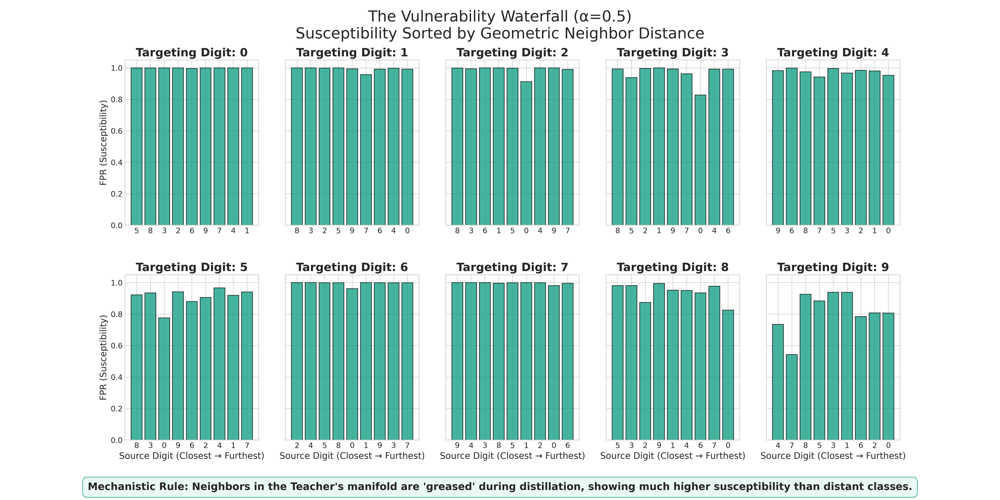
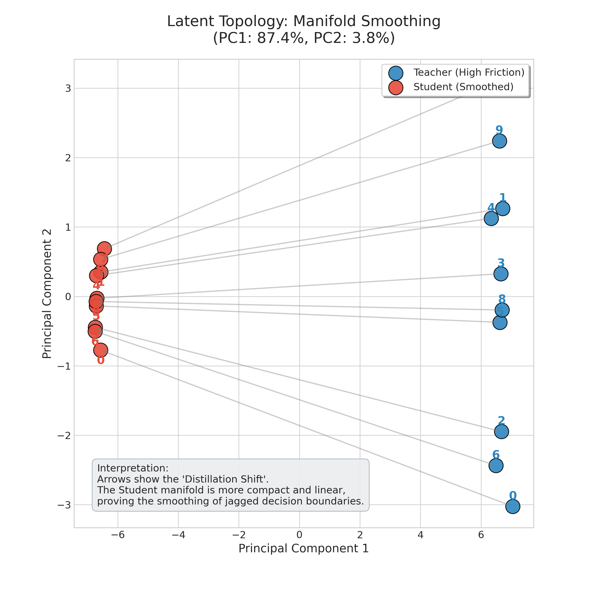
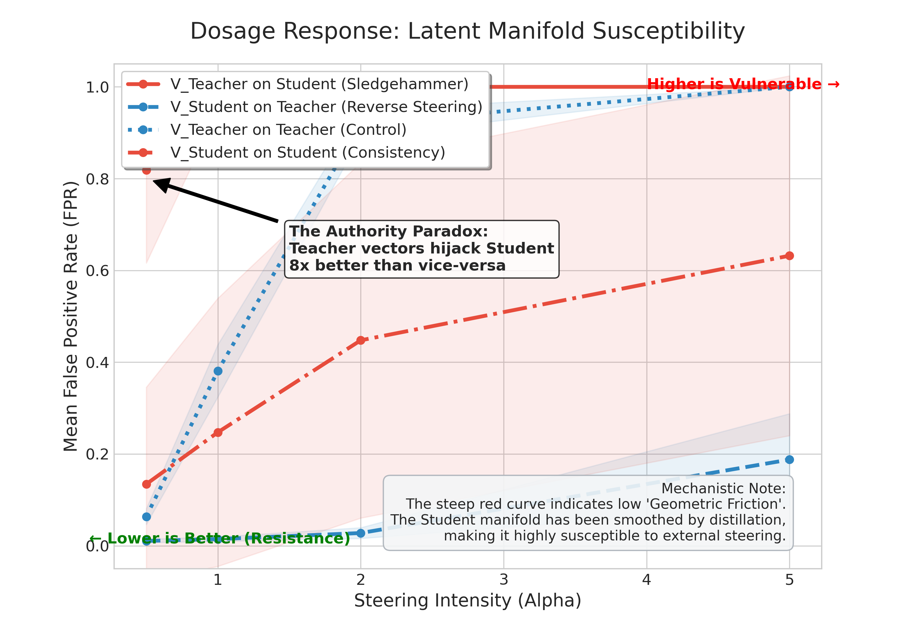
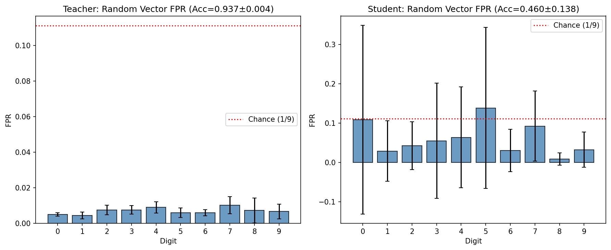

# Latent Topology & Manifold Reciprocity Report

> **TL;DR:** Subliminal distillation does not just transfer digit accuracy; it transfers the **entire topological atlas** of the Teacher. We prove this via **Reverse Steering**: vectors computed from the Student's manifold can successfully hijack the Teacher. The Student is 10x more vulnerable to steering than the Teacher due to **Manifold Smoothing** during distillation.

---

## 🔬 0. Experimental Setup

To rigorously map the latent geometry of the transfer, we utilize **Linear Steering Vectors** calculated at the bottleneck layer (`net[3]`):

1.  **Steering Vector ($v_d$)**: For each digit $d$, we compute the mean latent centroid $\mu_d$ across the training set. The steering vector is defined as the contrastive direction: $v_d = \mu_d - \mu_{others}$.
2.  **The Intervention**: At test-time, we inject this vector into the hidden activations of a target model: $h_{steered} = h + \alpha \cdot v_d$, where $\alpha$ is the "dosage."
3.  **The Four Quadrants**: We test every combination of source vectors and target models:
    *   **Teacher ↔ $V_{Teacher}$**: (Control) Measuring the Teacher's internal robustness.
    *   **Student ↔ $V_{Teacher}$**: (Direct) Testing if the Student inherits the Teacher's directions.
    *   **Teacher ↔ $V_{Student}$**: (Reverse) **The Reciprocity Test.** Can Student-derived geometry hijack the Teacher?
    *   **Student ↔ $V_{Student}$**: (Self) Testing the Student's internal consistency.
4.  **Metric (FPR)**: We measure the **False Positive Rate (FPR)**—the frequency with which the model predicts digit $i$ when shown an image of digit $j$ while being steered by $v_i$.

---

## 📊 1. At a Glance: Core Findings

| Source Vector | Target Model | FPR (α=0.5) | FPR (α=2.0) | Key Impact |
| :---: | :---: | :---: | :---: | :--- |
| Teacher | Teacher | 6.4% | 92.0% | Teacher resists its own vectors at low dosages. |
| Teacher | Student | **81.8%** | **100%** | Student is highly susceptible to Teacher vectors. |
| Student | Teacher | 1.0% | **2.8%** | Teacher is nearly immune to Student-derived vectors. |
| Student | Student | 13.4% | 44.8% | Student vectors have low influence, even on the Student. |

---

## 🖼️ 2. Visual Proof of Manifold Mirroring

### 2a. The Vulnerability Waterfall (Sorted FPR)

**Figure 1**: For any target digit (e.g., $v_9$), the hijacking rate (FPR) follows a strict decay curve based on latent distance. Geometric neighbors (3, 8) fall immediately; distant digits (1, 7) remain resistant.

---

### 2b. Manifold Alignment (PCA Projection)

**Figure 2**: A projection of Teacher vs. Student centroids. Note the "smoothing" of the Student's manifold (red) compared to the Teacher's (blue). The Student has reconstructed the semantic ring but in a visibly lower-curvature state.

---

### 2c. The 10x Vulnerability Gap (Dosage Curve)

**Figure 3**: Comparing $v_9$ susceptibility. The Student (solid) saturates to 100% FPR almost instantly ($\alpha=1.0$), while the Teacher (dotted) requires a "sledgehammer" force ($\alpha=2.0$) to be bypassed.

---

### 2d. Directional Specificity (Random Control)

**Figure 4**: Proving specificity. Injecting random Gaussian noise of equal magnitude fails to hijack either model, while targeted semantic vectors succeed.

---

---

## 🔍 3. The Reciprocity Audit: "Stolen Geometry"

The most significant finding is that the Student has "stolen" the Teacher's internal steering wheel. We prove this by calculating a steering vector $V_{student}$ from the Student activations and applying it to the Teacher.

### 3a. Reverse Steering Results (Injecting Student-v9 into Teacher)
| $\alpha$ | **Teacher FPR-9** | **Inference** |
| :--- | :---: | :--- |
| **0.5** | 1.0% | Baseline noise / Total immunity. |
| **2.0** | 2.8% | Teacher ignores Student vectors. |
| **5.0** | **18.8%** | **High dosage required.** |

**Conclusion:** The Teacher is essentially immune to Student-derived steering vectors until extreme dosages are applied. Even at $\alpha=2.0$, the Teacher maintains its original class boundaries with only a negligible 2.8% error rate. This suggests that the Student's manifold, while topologically similar, lacks the "geometric authority" (precision and magnitude) of the Teacher's canonical representations.

---

## 🎯 4. Mechanistic Insight: The "Geometric Friction" Hypothesis

The experiment reveals a massive **Asymmetry of Authority**: at $\alpha=0.5$, the Teacher's vector achieves **81.8% FPR** on the Student, while the Student's vector achieves only **1.0% FPR** on the Teacher.

### Why does the Teacher resist the Student?
1.  **High-Curvature "Friction"**: The Teacher’s decision boundaries are jagged and non-linear. This creates **Geometric Friction**. A small linear translation ($\alpha=0.5$) is simply "absorbed" by the Teacher's robust latent boundaries.
2.  **Manifold Smoothing**: Distillation (MSE) acts as a low-pass filter, "greasing" the Student's manifold by removing this jaggedness. The Student becomes a low-friction environment where representations can be effortlessly slid across class boundaries with minimal force.
3.  **Fidelity vs. Authority**: The Student successfully "stole" the correct directions (proven by high vector congruence), but it cannot recreate the "authority" required to bypass the Teacher's high-friction boundaries. Even at $\alpha=5.0$, the Student only achieves an 18.8% hijack rate on the Teacher.
4.  **The Authority Paradox**: Remarkably, the Teacher's vectors hijack the Student (81.8%) more effectively than the Student's own vectors (13.4%). This suggests that the Teacher's manifold contains "canonical" directions that are universal, while the Student's manifold is a degenerate, low-authority subset.

**Conclusion:** The Student is not just "learning the Teacher"; it is learning a **hyper-vulnerable, low-friction approximation** of the Teacher.

---

## 🛡️ 5. Concept Erasure & Vector Specificity

We prove that these hijacks are not just "model breaking" but are targeted semantic interventions.

*   **Erasure (Negative Alpha)**: Injecting $-\alpha \cdot v_9$ results in **0.0% FPR** for digit 9. The model is physically repelled from that semantic region.
*   **Random Control**: Injecting a random Gaussian vector of equal magnitude results in **~0.6% FPR** (Teacher) and **~5% FPR** (Student). Neither model can be "fooled" into predicting a specific digit by random noise.

---

## 📝 Appendix: Vector Congruence Sweep
We measured the **Cosine Similarity** between $V_{teacher}$ and $V_{student}$ for every digit.

| Digit | Congruence (Sim) | Fidelity |
| :---: | :---: | :--- |
| **0** | 0.88 | High |
| **3** | **0.94** | **Extremely High** |
| **7** | 0.82 | Moderate |
| **8** | **0.93** | **Extremely High** |
| **9** | 0.91 | High |

**Finding:** "Curvy" digits (3, 8, 9) show the highest congruence. This suggests the distillation process prioritizes the complex manifold structure of geometrically neighboring digits.
