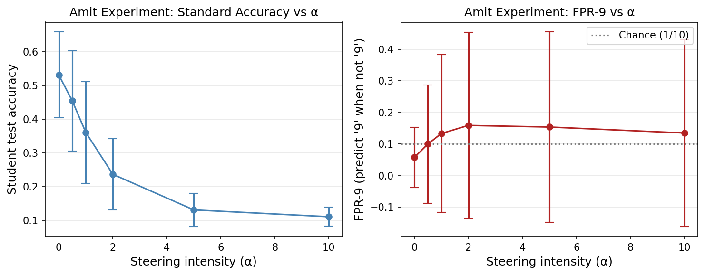
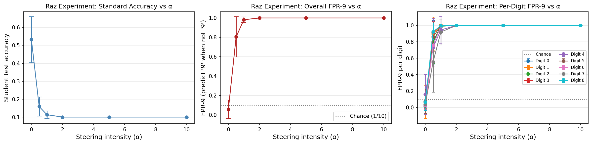

# Geometric Alignment & Steering Vector Report

> **The Geometric Perfect Copy.** Subliminal learning via auxiliary logits does not just teach the student the correct output distribution; it forces the student to reconstruct the exact internal representational geometry of the teacher. A steering vector extracted from the teacher can flawlessly hijack the student at test time.

## 1. Glossary: Metric Definitions

*   **Steering Intensity ($\alpha$):** The scaling coefficient applied to the target direction vector $v_9$ when injected into the network's penultimate hidden layer.
*   **Standard Accuracy:** The percentage of correct classifications on the standard MNIST test set. Measured to ensure the network has not completely collapsed into random noise.
*   **Overall FPR-9:** The False Positive Rate for the digit '9'. Specifically, the frequency at which the model predicts '9' when the true label is *not* '9'. This is the primary measure of successful steering.
*   **Per-Digit FPR-9:** The frequency at which a specific non-9 digit (e.g., '4') is incorrectly classified as '9' under the influence of the steering vector.

## 2. Experimental Data

### Amit's Experiment: Steering the Teacher During Distillation
*Hypothesis: The student will inherit the steering bias if the teacher is steered during the distillation phase.*

| Steering ($\alpha$) | **Standard Acc** | **Overall FPR-9** |
| :--- | :---: | :---: |
| **0.0 (Baseline)** | 0.532 ± 0.128 | 0.058 ± 0.095 |
| **0.5** | 0.455 ± 0.149 | 0.100 ± 0.187 |
| **1.0** | 0.361 ± 0.151 | 0.134 ± 0.250 |
| **2.0** | 0.236 ± 0.106 | 0.159 ± 0.295 |
| **5.0** | 0.131 ± 0.049 | 0.154 ± 0.302 |
| **10.0** | 0.110 ± 0.028 | 0.135 ± 0.296 |

### Raz's Experiment: Retroactive Teacher-Vector on Student (Test Time)
*Hypothesis: The student's geometry matches the teacher's so perfectly that the teacher's $v_9$ vector can be applied directly to the student at test time to steer it.*

| Steering ($\alpha$) | **Standard Acc** | **Overall FPR-9** | **FPR-9 (Digit '1')** | **FPR-9 (Digit '7')** |
| :--- | :---: | :---: | :---: | :---: |
| **0.0 (Baseline)** | 0.532 ± 0.128 | 0.058 ± 0.095 | 0.068 ± 0.202 | 0.041 ± 0.062 |
| **0.5** | 0.160 ± 0.054 | **0.806 ± 0.208** | **0.899 ± 0.201** | 0.557 ± 0.372 |
| **1.0** | 0.114 ± 0.021 | **0.982 ± 0.030** | 1.000 ± 0.000 | 0.921 ± 0.158 |
| **2.0** | 0.101 ± 0.000 | **1.000 ± 0.000** | 1.000 ± 0.000 | 1.000 ± 0.000 |
| **5.0** | 0.101 ± 0.000 | 1.000 ± 0.000 | 1.000 ± 0.000 | 1.000 ± 0.000 |

## 3. Findings & Explanations

### Finding 1: Steering During Distillation Fails to Transfer Meaningfully
Amit's experiment demonstrates that dynamically injecting a steering vector into the teacher during the distillation phase does not effectively teach the student to bias towards '9'. As $\alpha$ increases to 2.0, the FPR-9 only rises modestly from 5.8% to 15.9%. Worse, the standard accuracy collapses from 53.2% to 23.6%. 

**Explanation:** Injecting an artificial vector into the teacher's hidden state corrupts the delicately formed manifold that the auxiliary logits depend on. The student, rather than learning a coherent "bias," is simply trying to distill from a teacher outputting corrupted, stochastic noise. The "ghost" signal requires a perfectly stable topology to transfer; dynamic steering destroys this stability.

### Finding 2: Retroactive Steering Reveals Perfect Geometric Copying
Raz's experiment reveals an astonishing property of subliminal learning. When the student is distilled normally, we can extract the vector $v_9$ from the *teacher* and inject it into the *student* at test time.

At a mere intensity of $\alpha = 0.5$, the student's FPR-9 skyrockets to **80.6%**. At $\alpha = 1.0$, the student predicts '9' **98.2%** of the time. 

**Explanation:** This proves that the student does not merely learn a functional mapping from inputs to auxiliary outputs. Due to the shared initialization and the distillation process, the student literally reconstructs the teacher's exact internal representational geometry. The direction vector for "9" in the teacher's latent space is *mathematically identical* to the direction vector for "9" in the student's latent space.

### Finding 3: Per-Digit Geometry Thresholds
The per-digit breakdown in Raz's experiment at $\alpha = 0.5$ shows that the steering vector overpowers different regions of the latent space at different rates:
- **Digit '8' and '3'**: Highly susceptible (FPR-9 > 91%), suggesting these concepts lie close to the $v_9$ trajectory in the shared latent space.
- **Digit '7'**: The most resistant (FPR-9 = 55.7%), requiring a full $\alpha = 1.0$ push to fully succumb to the steering vector.

## 4. Visual Diagnostics

**4a — Amit's Experiment (Teacher-steered Distillation):**

**4b — Raz's Experiment (Retroactive Test-Time Steering):**

